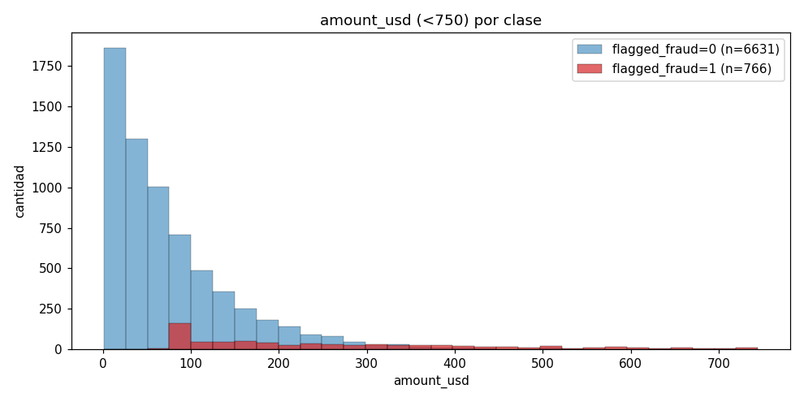
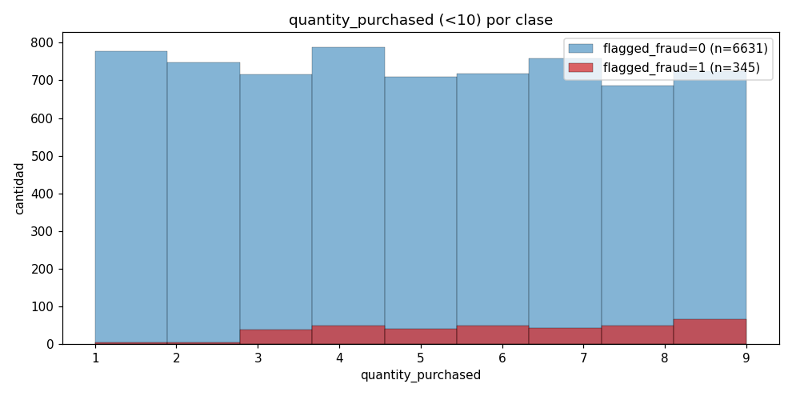
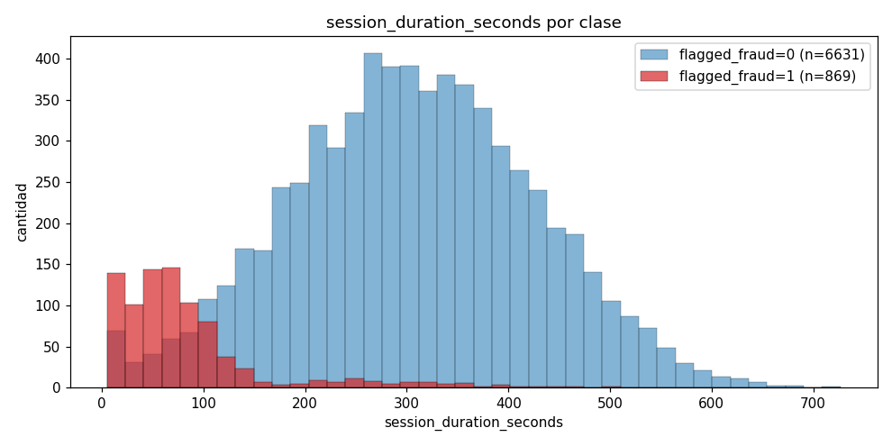
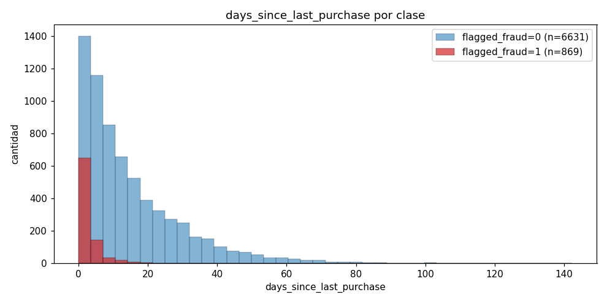
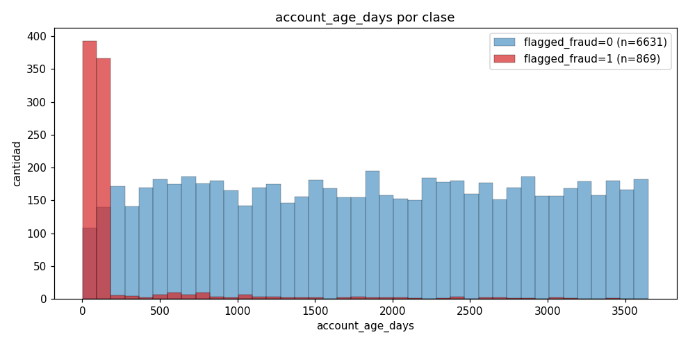
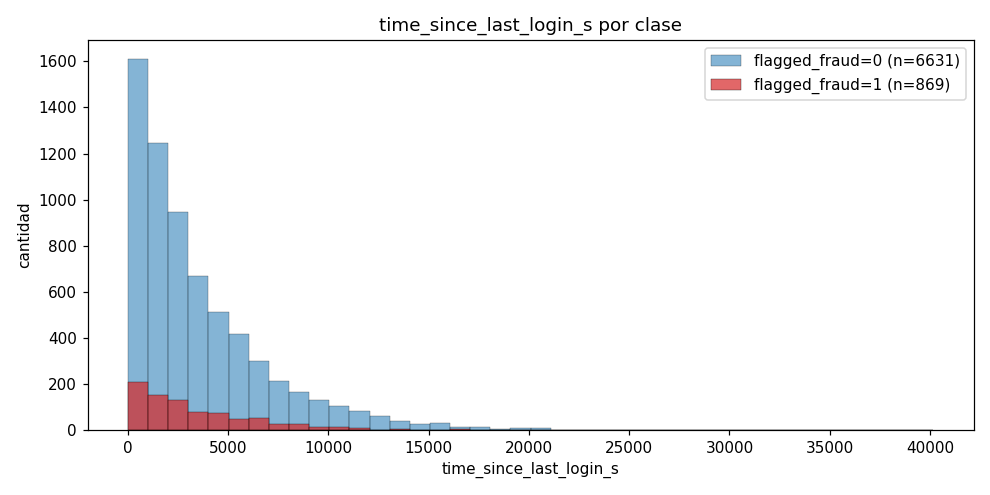
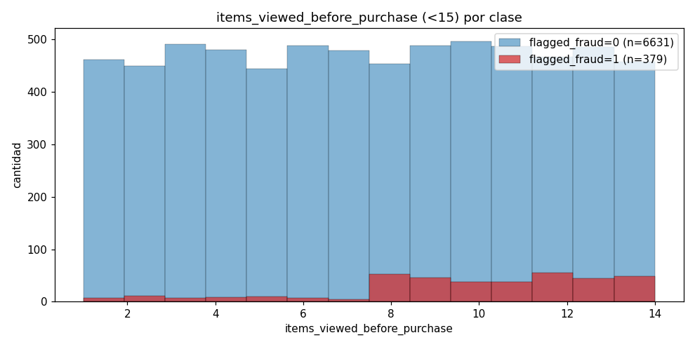

# Análisis desarrollado — fraud_dataset

Documento que **expande** las observaciones de `analisis.md` con los números concretos y los gráficos pedidos. Las "compras fraudulentas" se definen como las filas con `flagged_fraud == 1` (ground truth, **no** se usa para entrenar; solo para análisis y evaluación).

## Contexto general del dataset

- **Total de filas:** 7500
- **Fraude (flagged_fraud=1):** 869 → **11.59%**
- **No fraude (flagged_fraud=0):** 6631 → **88.41%**

Hay **desbalance de clases** (~1 fraude cada 8.6 transacciones). Esto importa para entrenar y para la elección del umbral final.

### Hallazgo clave: reglas determinísticas combinadas

Antes de entrar feature por feature, vale la pena adelantar el resultado: tres features tienen **umbrales duros que separan perfectamente** las clases. Combinándolos:

```
amount_usd > 500    OR    quantity_purchased >= 10    OR    items_viewed_before_purchase >= 15
```

| Métrica | Valor |
|---------|-------|
| Fraude capturado por las reglas | **695 / 869 → 80.0%** |
| Falsos positivos (no-fraude marcado por la regla) | **0** |
| Fraude que **escapa** a las reglas | **174** |

Es decir: el 80% del fraude se puede etiquetar con tres `if` sin error. El **20% restante (174 casos)** es el verdadero desafío del perceptrón — son fraudes que **no violan ningún umbral duro** y donde el modelo tiene que combinar features sutilmente.

Esto explica por qué el `big_model_fraud_probability` tiene la distribución relativamente esparcida que vimos: los casos "obvios" están cerca de 0 o 1, pero la zona de transición concentra los casos sutiles.

---

## timestamp vs target

> *"Pareciera que no influye timestamp. Podemos probar de entrenar el modelo excluyendo esta columna."*

Confirmado. Pearson `r = +0.001` con `big_model_fraud_probability` y `r = −0.013` con `flagged_fraud`. **Ruido puro.**

**Recomendación:** descartar `timestamp` del set de features de entrenamiento. No agrega señal y tiene magnitud absurdamente grande (~1.7e9), lo cual además rompe el escalado si se mete sin normalizar.

---

## amount_usd vs target

> *"Si una compra tiene amount > 500 es muy probable que sea fraudulento. La mayoría de los datos fraudulentos están abajo de 750 amount_usd."*

**Tu hipótesis no solo es correcta — es más fuerte de lo que pensaste:** `amount > 500` no es "muy probable" fraude, **es 100% fraude**.

| Query | Resultado |
|-------|-----------|
| Total fraude | 869 |
| Fraude con `amount < 500` | 666 (**76.6%** del fraude) |
| Fraude con `amount < 750` | 766 (**88.1%** del fraude) |
| Fraude con `amount > 500` | 199 (22.9% del fraude) |
| Fraude con `amount > 750` | 103 (11.9% del fraude) |
| **No-fraude con `amount > 500`** | **0** |
| **No-fraude con `amount > 750`** | **0** |
| **% fraude entre los que tienen `amount > 500`** | **100.0%** |
| **% fraude entre los que tienen `amount > 750`** | **100.0%** |

Es decir, hay un **umbral duro en \$500**: ninguna transacción legítima en el dataset supera ese monto. Es regla determinística.

La distribución del fraude **dentro de** `amount < 750` (donde está el 88% del fraude) sigue siendo informativa porque ahí también hay no-fraude — esa es la zona donde el modelo tiene que diferenciar. La parte interesante es esa: la mediana del dataset está en \$63, así que la mayor parte del análisis tiene que pasar bajo \$500.



**Lectura:** la cola superior del histograma (entre 500 y 750) es **toda fraude**, mientras que en el rango bajo (<200) ambas clases conviven y el fraude está más diluido pero presente.

---

## quantity_purchased vs target

> *"De 10 quantity en adelante solo hay compras fraudulentas."*

**Confirmadísimo, y es regla determinística** igual que con `amount`.

| Query | Resultado |
|-------|-----------|
| Filas con `quantity > 10` | 487 (6.49% del total) |
| Filas con `quantity >= 10` | 524 |
| **Fraude con `quantity >= 10`** | **524 (100%)** |
| **No-fraude con `quantity >= 10`** | **0** |
| Filas con `3 <= quantity <= 9` | 5441 |
| ↳ Fraude | 336 (**6.2%**) |
| ↳ No-fraude | 5105 (93.8%) |

Distribución detallada por valor de quantity:

| quantity | total | fraude | % fraude |
|---:|---:|---:|---:|
| 1 | 783 | 5 | 0.6% |
| 2 | 752 | 4 | 0.5% |
| 3 | 754 | 38 | 5.0% |
| 4 | 838 | 49 | 5.8% |
| 5 | 750 | 40 | 5.3% |
| 6 | 768 | 49 | 6.4% |
| 7 | 803 | 44 | 5.5% |
| 8 | 737 | 50 | 6.8% |
| 9 | 791 | 66 | **8.3%** |
| **10–24** | **524** | **524** | **100%** |

Patrón claro: con 1–2 unidades **casi no hay fraude** (<1%); entre 3 y 9 la tasa de fraude oscila alrededor del 5–8%; y al pasar a 10 o más se vuelve **fraude garantizado**.



**Lectura:** en el rango `<10` la clase azul (no-fraude) domina ampliamente y el fraude aparece como una capa fina y plana. La transición de 9 a 10 es una **discontinuidad** en el espacio de features: cualquier modelo lineal en quantity va a tener problemas para representar ese salto a menos que se ayude con activación no-lineal o con feature engineering (por ejemplo, una indicadora `quantity >= 10`).

---

## session_duration_seconds vs target

> *"No hay compras fraudulentas con session_duration > 500. La mayoría de las compras con session < 50 son fraudulentas."*

| Query | Resultado |
|-------|-----------|
| Fraude con `session > 500` | **1** (no es 0 pero casi) |
| No-fraude con `session > 500` | 350 |
| Fraude con `session > 300` | 36 |
| Fraude con `session > 150` | 95 |
| Fraude con `session < 50` | 307 (**35.3%** del fraude) |
| **% fraude entre `session < 50`** | **72.2%** |
| Fraude con `session < 150` | 774 (**89.1%** del fraude) |
| **% fraude entre `session < 150`** | **53.6%** |
| Fraude con `50 <= session < 150` | 467 (53.7% del fraude) |
| Filas con `200 <= session <= 500` | 5086 |
| ↳ Fraude entre ellas | 79 (**1.6%**) |

La hipótesis "no hay fraude con session > 500" es casi cierta: hay **un solo caso** entre 869. Operativamente se puede tratar como umbral.

Distribución del `big_model_fraud_probability` para fraudes con `session < 150`:

| Estadístico | Valor |
|-------------|-------|
| count | 774 |
| mean | **0.979** |
| std | 0.037 |
| min | 0.850 |
| 25% | 0.982 |
| 50% (mediana) | 0.997 |
| 75% | 0.9997 |
| max | 1.000 |

**Lectura importante:** cuando hay fraude **y** la sesión es corta, el BigModel está casi siempre **muy confiado** (probabilidad > 0.85, mediana 0.997). Es decir, una sesión muy corta es una señal **fuerte** de fraude que el BigModel ya internalizó. El TinyModel debería poder reproducir esto.



---

## days_since_last_purchase vs target

> *"Si una compra tiene days > 20, muy probablemente no sea fraudulenta."*

Confirmado.

| Query | Resultado |
|-------|-----------|
| Fraude con `days > 20` | 11 |
| No-fraude con `days > 20` | 1791 |
| **% fraude entre `days > 20`** | **0.6%** |
| Fraude con `days < 5` | 734 (**84.5%** del fraude) |
| Fraude con `days < 1` | 302 (34.8% del fraude) |
| % fraude entre `days < 1` | **40.7%** |
| % fraude entre `days < 5` | 27.8% |

**Hipótesis adicional sugerida** (queries interesantes que pediste):

- El 84.5% del fraude tiene `days < 5`, lo cual es muy sesgado.
- Tasa de fraude por bucket:

  | Rango de days | % fraude |
  |---|---|
  | `< 1` | 40.7% |
  | `< 5` | 27.8% |
  | `> 20` | 0.6% |

- Esto sugiere que el comportamiento "compré algo recientemente y ahora vuelvo a comprar" correlaciona fuerte con fraude — patrón típico de uso de tarjeta robada (testeo + cargo grande en pocas horas/días).



---

## account_age_days vs target

> *"La mayoría de las compras fraudulentas están < 250. Las no fraudulentas parecieran estar > 1500."*

Ambas hipótesis confirmadas con números fuertes.

| Query | Resultado |
|-------|-----------|
| % fraude entre los que tienen `age < 250` | **66.8%** |
| % no-fraude entre los que tienen `age < 250` | 33.2% |
| Fraude con `age < 250` | 763 (**87.8%** del fraude) |
| No-fraude con `age < 250` | 379 (**5.7%** del no-fraude) |
| No-fraude con `age > 1500` | 3963 (**59.8%** del no-fraude) |
| No-fraude con `age > 2000` | 3045 (**45.9%** del no-fraude) |
| Fraude con `age > 1500` | 34 (3.9% del fraude) |
| % fraude entre `age > 1500` | **0.9%** |

**Lectura:** las cuentas **nuevas (<250 días)** son el ~88% del fraude pero solo el ~6% de las legítimas. Y las cuentas **viejas (>1500 días)** son ~60% de las legítimas y casi nada de fraude. `account_age_days` es probablemente la **feature individual más informativa** del dataset (junto con la combinación `amount_usd` × `quantity`).



**Lectura:** dos modos casi disjuntos — el fraude se concentra a la izquierda, el no-fraude a la derecha, con poca superposición. Idealmente cualquier modelo va a explotar fuerte esta señal.

---

## device_screen_resolution vs target

> *"Pareciera que no te dice nada. Coeficiente de correlación 0."*

Confirmado: `r = +0.025` con el target probabilístico, `r = +0.015` con `flagged_fraud`. **Descartable.**

Posiblemente esta columna existe en el dataset original como una pista falsa o como ruido controlado.

---

## time_since_last_login_s vs target

> *(Pediste un gráfico de distribución por clase con time_since_last_login en X.)*

| Métrica | Valor |
|---|---|
| Pearson r vs `flagged_fraud` | −0.003 |
| Pearson r vs `big_model_fraud_probability` | +0.002 |

**También ruido.** No correlaciona ni con el target ni con la clase real. La distribución de fraude y no-fraude se superpone casi perfectamente, como muestra el gráfico:



**Recomendación:** descartar junto con `timestamp` y `device_screen_resolution`.

---

## items_viewed_before_purchase vs target

> *"Si items_viewed >= 15, altísimamente probable que sea fraudulento. Debajo de 15, mayoría del fraude entre 8 y 14."*

**La primera hipótesis es absoluta** — igual que `amount > 500` y `quantity >= 10`, hay umbral duro:

| Query | Resultado |
|-------|-----------|
| Fraude con `items >= 15` | 490 (**56.4%** del fraude) |
| **No-fraude con `items >= 15`** | **0** |
| **% fraude entre `items >= 15`** | **100.0%** |

La segunda hipótesis (concentración del fraude entre 8 y 14 dentro del rango `<15`) **no se sostiene tan claramente**:

| items | total | fraude | % fraude |
|---:|---:|---:|---:|
| 8 | 506 | 53 | 10.5% |
| 9 | 535 | 46 | 8.6% |
| 10 | 535 | 38 | 7.1% |
| 11 | 525 | 38 | 7.2% |
| 12 | 522 | 55 | 10.5% |
| 13 | 530 | 44 | 8.3% |
| 14 | 507 | 49 | 9.7% |

La tasa de fraude oscila entre 7% y 10% sin un pico claro en ese rango. Es una zona de **base rate elevado pero plano**. El salto se da en la frontera 14 → 15 (de ~10% a 100%), igual que con `quantity` en 9 → 10.



---

## Resumen ejecutivo

### Features informativas (las que el perceptrón debería usar)

| Feature | Pearson r vs target | Característica clave |
|---|---:|---|
| `account_age_days` | −0.585 | Dos modos casi disjuntos, fraude < 250 |
| `quantity_purchased` | +0.563 | Umbral duro en 10 (100% fraude) |
| `amount_usd` | +0.557 | Umbral duro en 500 (100% fraude) |
| `session_duration_seconds` | −0.514 | Fraude concentrado en sesiones cortas |
| `days_since_last_purchase` | −0.404 | Fraude en compras muy recientes |
| `items_viewed_before_purchase` | +0.334 | Umbral duro en 15 (100% fraude) |

### Features descartables

| Feature | r | Razón |
|---|---:|---|
| `timestamp` | +0.001 | Sin señal, magnitud enorme molesta normalización |
| `device_screen_resolution` | +0.025 | Sin señal |
| `time_since_last_login_s` | +0.002 | Sin señal |

### Implicancias para el modelo

1. **80% del fraude se captura con tres reglas duras** (`amount > 500` ∨ `quantity >= 10` ∨ `items >= 15`) sin un solo falso positivo. Cualquier modelo debería al menos igualar esta línea de base; si no la iguala, hay un problema de capacity o normalización.
2. **El 20% restante (~174 fraudes "sutiles")** requiere combinar las features continuas (`account_age_days`, `session_duration_seconds`, `days_since_last_purchase`) con activación no-lineal. Es donde se va a notar la diferencia entre perceptrón lineal y no-lineal del Ej 1.
3. **Las tres reglas duras son discontinuidades** (saltos de tasa de fraude del ~6% al 100% en un solo entero). Un perceptrón lineal sin feature engineering va a tener que "tirar la recta" muy empinada para acercarse, sacrificando precisión en el rango bajo. El no-lineal con sigmoide puede acomodar mejor el salto, pero igual no lo modela perfecto — esa es la limitación geométrica que mencionamos.
4. **Desbalance de clases (~12% positivos)** importa para la elección del umbral final cuando se compare contra `flagged_fraud`. Conviene reportar precision/recall y curva ROC, no solo accuracy (que con 88% no-fraude se infla solo).
