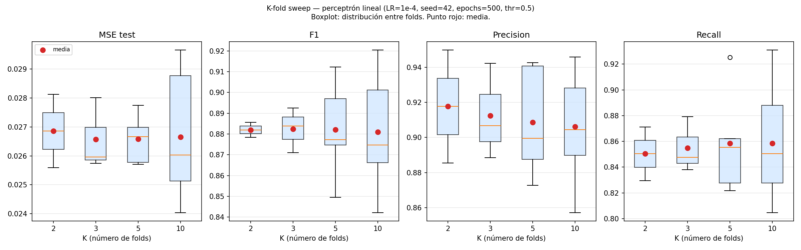

# K-fold sweep — perceptrón lineal

## Configuración del experimento

- LR fijo: `1e-4` (ganador del sweep de LR)
- Seed: `42`
- Épocas: `500` (suficiente para plateau, ver sweep LR)
- Threshold: `0.69` (thr* del lineal — max F1 promedio en el sweep multi-seed de LR)
- K evaluados: [2, 3, 5, 10]
- Estratificado por `flagged_fraud`: sí

## Tamaño de folds por K

| K | n_train (media) | n_test (media) | Positivos en test (media) |
|---|---|---|---|
| 2 | 3750 | 3750 | 434 |
| 3 | 5000 | 2500 | 290 |
| 5 | 6000 | 1500 | 174 |
| 10 | 6750 | 750 | 87 |

## Resultados (mean ± std entre folds, a thr=0.5)

| K | MSE test | F1 | Precision | Recall | Accuracy |
|---|---|---|---|---|---|
| 2 | 0.02686 ± 0.00127 | 0.8820 ± 0.0036 | 0.9177 ± 0.0322 | 0.8504 ± 0.0209 | 0.9736 ± 0.0016 |
| 3 | 0.02657 ± 0.00102 | 0.8825 ± 0.0089 | 0.9125 ± 0.0223 | 0.8550 ± 0.0177 | 0.9736 ± 0.0021 |
| 5 | 0.02658 ± 0.00076 | 0.8821 ± 0.0213 | 0.9086 ± 0.0283 | 0.8585 ± 0.0368 | 0.9735 ± 0.0047 |
| 10 | 0.02665 ± 0.00206 | 0.8809 ± 0.0250 | 0.9062 ± 0.0265 | 0.8584 ± 0.0420 | 0.9732 ± 0.0054 |

## Std entre folds por K (métrica de estabilidad del estimador)

| K | std MSE test | std F1 |
|---|---|---|
| 2 | 0.00127 | 0.0036 |
| 3 | 0.00102 | 0.0089 |
| 5 | 0.00076 | 0.0213 |
| 10 | 0.00206 | 0.0250 |

## Conclusión

> Completar con los resultados reales: comparar std de F1 entre K=5 y K=10. Si la diferencia es menor que 0.005, K=5 es suficiente.