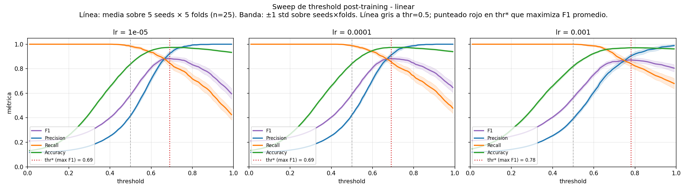
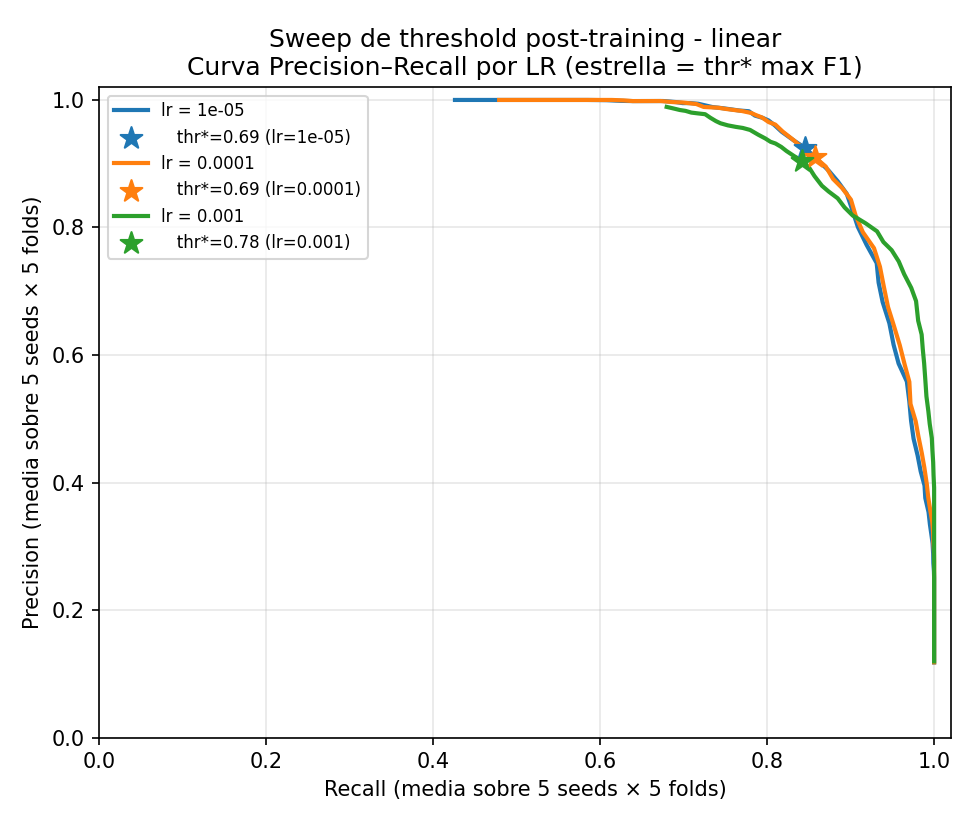
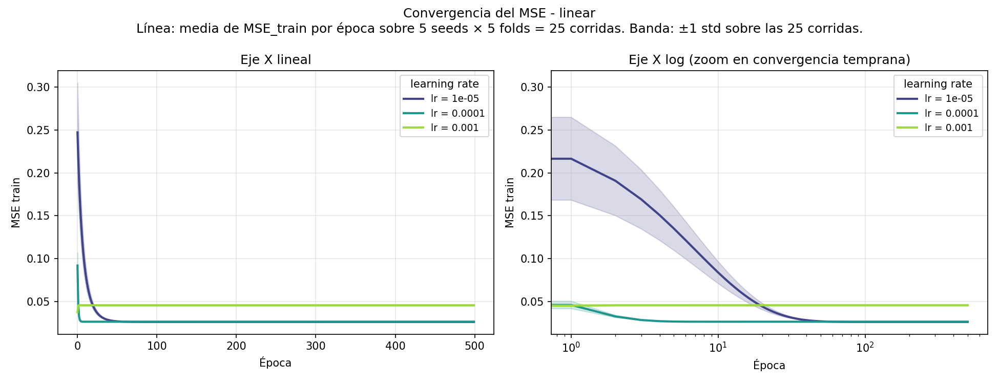
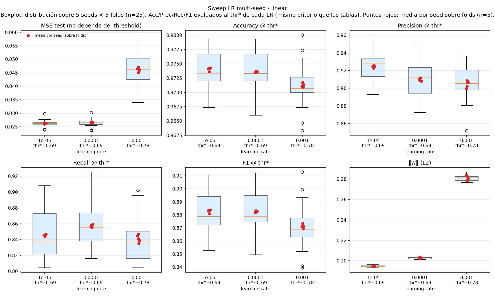

## Sweep de threshold (post-training)

El threshold de decisión vive **post-training**: no cambia los pesos del perceptrón, sólo decide cómo binarizar la salida continua. Por eso este sweep no requiere re-entrenar — se reconstruyen las predicciones de cada (lr, seed, fold) a partir de los pesos guardados y se evalúan métricas sobre una grilla densa de thresholds.

Criterio para elegir un threshold: nos interesa conseguir la mejor recall posible sin dejar de lado la precision; Notamos que con thresholds bajos la recall queda alta, pero con poca precision. Estamos flaggeando demasiadas compras como fraude, y asi es facil agarrar la mayor cantidad de fraudes posible. Entonces queremos un **balance** entre precision y recall -> usamos F1 para la decisión.
# Sweep LR multi-seed — perceptrón linear

Experimento: 5 seeds × 3 LRs × 5 folds = 75 entrenamientos. `epochs=500` (suficiente para convergencia segun single-seed). Seeds: [7, 13, 21, 42, 99].

**Métricas reportadas** (regla del repo: error apropiado a la loss + Acc/Prec/Rec/F1):

- **MSE test**: error de la loss usada para entrenar (objetivo de la knowledge distillation contra `big_model_fraud_probability`).
- **Accuracy / Precision / Recall / F1**: clasificación binaria contra `flagged_fraud`, **cada LR evaluado a su threshold óptimo `thr*`** (el que maximiza F1 promedio sobre las 25 corridas, ver sección "Sweep de threshold" arriba). Mapping usado en todas las tablas que siguen: `lr=1e-5 → thr*=0.69`, `lr=1e-4 → thr*=0.69`, `lr=1e-3 → thr*=0.78`. Reportar a thr=0.5 fijo era engañoso porque a ese corte los modelos predicen ~todo como fraude (Recall≈1.0, Precision≈0.4); thr* hace la comparación honesta entre LRs.
- **‖w‖**: norma L2 del vector de pesos final (slide *L2 Penalty Norm / Weight Decay* de la clase de regularización), reportada como diagnóstico de capacidad efectiva, no como término de loss.

**Convención de promedios** (regla del repo): cada celda aclara qué se promedia y sobre qué eje. `mean ± std` total = sobre las 25 corridas (5 seeds × 5 folds). `seed-std` = std de los promedios por seed (cada uno ya promediado sobre 5 folds), aislando la dispersión inter-seed.

## Convergencia del MSE

Cada curva es la **media del MSE de train por época sobre 25 corridas** (5 seeds × 5 folds) de un mismo LR. La banda alrededor es **±1 std sobre las 25 corridas**. El panel izquierdo muestra eje X lineal; el derecho, log para ver mejor la convergencia temprana.

### ¿Convergió por epsilon o por techo de épocas?

**Por techo de épocas.** Los 75 entrenamientos de este perceptrón (5 seeds × 3 LRs × 5 folds) corrieron las 500 épocas completas; el corte por `mse_train < epsilon` **nunca se disparó**. La razón es que `epsilon` está calibrado por debajo del MSE asintótico que alcanza la arquitectura sobre este dataset, así que pedir `mse_train < epsilon` es pedir un valor que el modelo no puede alcanzar. Por eso epsilon **no** sirve como evidencia de convergencia acá.

### El argumento que sí vale: plateau (pendiente en las últimas 50 épocas)

Convergencia, según la clase de optimizadores, es que la actualización **deja de cambiar el estado**: `ΔMSE/Δepoch → 0`. No es que MSE → 0. Para cada (lr, seed, fold) calculamos la pendiente del MSE en las últimas **50 épocas** (slope = (mse[T] − mse[T−49]) / 49) y la agregamos sobre las 25 corridas de cada LR:

| lr | MSE final (media sobre 25 runs) | tail-slope media | tail-slope max-abs | Δ MSE en 50 épocas | Δ% relativo |
|---|---|---|---|---|---|
| 1e-05 | 0.02611 | 4.82e-14 | 1.03e-13 | 2.36e-12 | 9.04e-09 % |
| 0.0001 | 0.02639 | 0.00e+00 | 0.00e+00 | 0.00e+00 | 0.00e+00 % |
| 0.001 | 0.04573 | 0.00e+00 | 2.12e-18 | 0.00e+00 | 0.00e+00 % |

**Lectura de la tabla:**

- LR 1e-05, 0.0001, 0.001: Δ% relativo está en el **ruido numérico de float64** (eps_máquina ≈ 1e-16). El modelo ya no aprende, oscila dentro del redondeo. **Plateau total.**

**Conclusión.** El argumento honesto de convergencia para este perceptrón es **plateau empírico** (la curva deja de moverse), no el corte por epsilon. La tabla cuantifica cuán plana está la curva en las últimas 50 épocas y permite distinguir LRs que efectivamente estabilizaron de los que no.

Implicancia práctica: si en una iteración futura quisiéramos un criterio de corte que se dispare antes del techo, no debería ser `mse < epsilon` sino algo basado en variación, p.ej. `abs(mean(mse[-50:]) - mean(mse[-100:-50])) < delta`.

## Resumen agregado por LR — todas las métricas (cada LR a su `thr*`)

**Total (mean ± std sobre 5 seeds × 5 folds = 25 corridas):**

| lr     | thr* | MSE test          | Accuracy        | Precision       | Recall          | F1              | ‖w‖             |
| ------ | ---- | ----------------- | --------------- | --------------- | --------------- | --------------- | --------------- |
| 1e-05  | 0.69 | 0.02622 ± 0.00119 | 0.9741 ± 0.0033 | 0.9247 ± 0.0176 | 0.8456 ± 0.0286 | 0.8830 ± 0.0159 | 0.1945 ± 0.0008 |
| 0.0001 | 0.69 | 0.02651 ± 0.00139 | 0.9736 ± 0.0035 | 0.9100 ± 0.0210 | 0.8573 ± 0.0280 | 0.8825 ± 0.0162 | 0.2027 ± 0.0010 |
| 0.001  | 0.78 | 0.04599 ± 0.00616 | 0.9713 ± 0.0038 | 0.9048 ± 0.0185 | 0.8414 ± 0.0266 | 0.8717 ± 0.0174 | 0.2810 ± 0.0027 |

**Dispersión entre seeds** (std de los promedios-por-seed; cada promedio-por-seed es media sobre los 5 folds, evaluado al `thr*` del lr):

| lr | MSE test seed-std | Acc seed-std | Prec seed-std | Rec seed-std | F1 seed-std | ‖w‖ seed-std |
|---|---|---|---|---|---|---|
| 1e-05  | 0.00002 | 0.0003 | 0.0012 | 0.0012 | 0.0012 | 0.0001 |
| 0.0001 | 0.00006 | 0.0001 | 0.0017 | 0.0018 | 0.0005 | 0.0006 |
| 0.001  | 0.00085 | 0.0003 | 0.0038 | 0.0046 | 0.0017 | 0.0025 |

## Per-seed (cada celda = media sobre los 5 folds del CV, evaluado al `thr*` del lr)

| lr | seed | MSE test | Accuracy | Precision | Recall | F1 | ‖w‖ |
|---|---|---|---|---|---|---|---|
| 1e-05  | 7  | 0.02621 | 0.9736 | 0.9228 | 0.8435 | 0.8810 | 0.1945 |
| 1e-05  | 13 | 0.02622 | 0.9743 | 0.9247 | 0.8469 | 0.8839 | 0.1946 |
| 1e-05  | 21 | 0.02619 | 0.9743 | 0.9258 | 0.8458 | 0.8837 | 0.1945 |
| 1e-05  | 42 | 0.02625 | 0.9741 | 0.9256 | 0.8458 | 0.8832 | 0.1946 |
| 1e-05  | 99 | 0.02621 | 0.9741 | 0.9246 | 0.8458 | 0.8833 | 0.1946 |
| 0.0001 | 7  | 0.02647 | 0.9737 | 0.9117 | 0.8574 | 0.8832 | 0.2021 |
| 0.0001 | 13 | 0.02654 | 0.9736 | 0.9080 | 0.8596 | 0.8829 | 0.2029 |
| 0.0001 | 21 | 0.02644 | 0.9736 | 0.9118 | 0.8550 | 0.8822 | 0.2021 |
| 0.0001 | 42 | 0.02658 | 0.9735 | 0.9086 | 0.8585 | 0.8821 | 0.2032 |
| 0.0001 | 99 | 0.02651 | 0.9735 | 0.9099 | 0.8562 | 0.8820 | 0.2033 |
| 0.001  | 7  | 0.04502 | 0.9717 | 0.9088 | 0.8413 | 0.8732 | 0.2782 |
| 0.001  | 13 | 0.04608 | 0.9713 | 0.9069 | 0.8389 | 0.8714 | 0.2805 |
| 0.001  | 21 | 0.04528 | 0.9709 | 0.9064 | 0.8354 | 0.8693 | 0.2793 |
| 0.001  | 42 | 0.04713 | 0.9716 | 0.9024 | 0.8470 | 0.8736 | 0.2831 |
| 0.001  | 99 | 0.04642 | 0.9711 | 0.8996 | 0.8447 | 0.8711 | 0.2841 |
# Conclusion
Para el perceptron lineal, el LR optimo es $10^-4$ con threshold $0.69$.
Los resultados son **muy similares** al LR $10^-5$ pero converge mucho antes.
LR = $10^-3$ sufre de SUBAJUSTE.

## Datos crudos

- `raw.csv` — una fila por (lr, seed, fold) con todas las métricas + ‖w‖.
- `per_seed.csv` — agregado por (lr, seed) (mean sobre los 5 folds).
- `summary.csv` — agregado por lr (mean/std sobre los 25 (seed, fold), y seed-std sobre los 5 promedios-por-seed).

### Datos crudos

- `threshold_sweep_raw.csv` — una fila por (lr, seed, fold, threshold) con Acc/Prec/Rec/F1.
- `threshold_summary.csv` — thr* global por lr y métricas a thr*.

