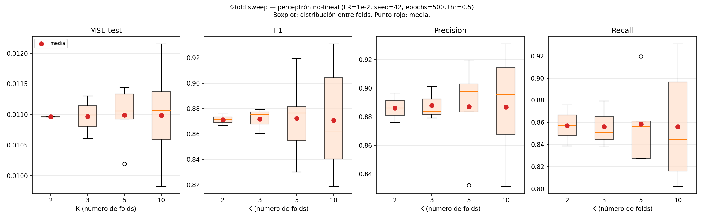

# K-fold sweep — perceptrón no-lineal

## Configuración del experimento

- LR fijo: `1e-2` (ganador del sweep de LR)
- Seed: `42` (seed-std≈0 en el sweep multi-seed → una seed es suficiente)
- Épocas: `500` (suficiente para plateau, ver sweep LR)
- Threshold: `0.89` (thr* del no-lineal — max F1 promedio en el sweep multi-seed de LR)
- K evaluados: [2, 3, 5, 10]
- Estratificado por `flagged_fraud`: sí

## Tamaño de folds por K

| K | n_train (media) | n_test (media) | Positivos en test (media) |
|---|---|---|---|
| 2 | 3750 | 3750 | 434 |
| 3 | 5000 | 2500 | 290 |
| 5 | 6000 | 1500 | 174 |
| 10 | 6750 | 750 | 87 |

## Resultados (mean ± std entre folds, a thr=0.5)

| K | MSE test | F1 | Precision | Recall | Accuracy |
|---|---|---|---|---|---|
| 2 | 0.01096 ± 0.00001 | 0.8713 ± 0.0046 | 0.8862 ± 0.0103 | 0.8573 ± 0.0186 | 0.9707 ± 0.0005 |
| 3 | 0.01097 ± 0.00028 | 0.8716 ± 0.0083 | 0.8880 ± 0.0094 | 0.8562 ± 0.0173 | 0.9708 ± 0.0017 |
| 5 | 0.01099 ± 0.00044 | 0.8724 ± 0.0298 | 0.8872 ± 0.0297 | 0.8585 ± 0.0336 | 0.9709 ± 0.0068 |
| 10 | 0.01099 ± 0.00062 | 0.8708 ± 0.0380 | 0.8867 ± 0.0332 | 0.8561 ± 0.0480 | 0.9707 ± 0.0085 |

## Std entre folds — métrica de estabilidad del estimador

| K | std MSE test | std F1 |
|---|---|---|
| 2 | 0.00001 | 0.0046 |
| 3 | 0.00028 | 0.0083 |
| 5 | 0.00044 | 0.0298 |
| 10 | 0.00062 | 0.0380 |

## Conclusión

> Completar con los resultados reales: comparar std de F1 entre K=5 y K=10. Si la diferencia es menor que 0.005, K=5 es suficiente.