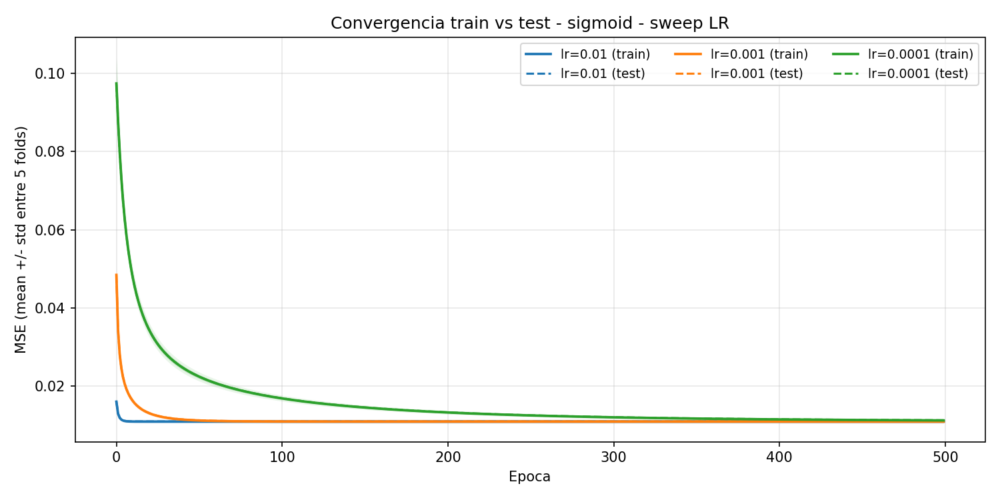
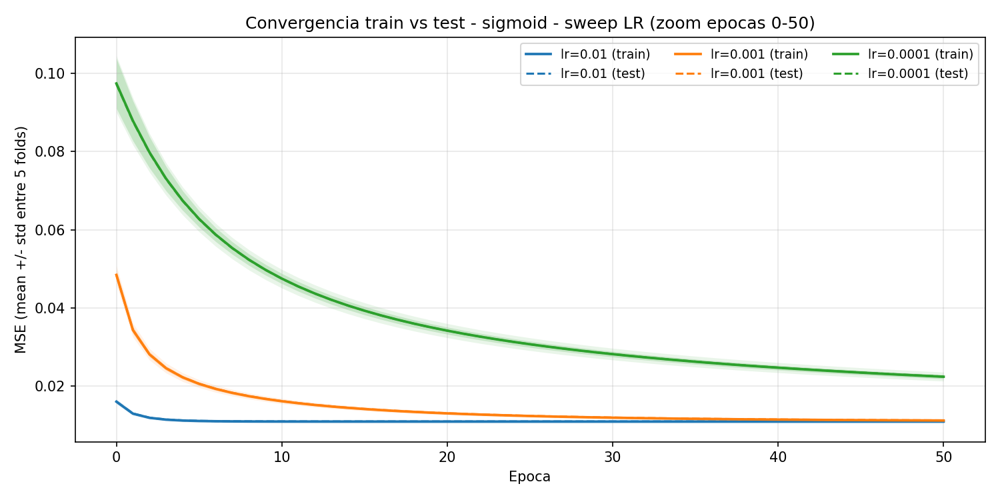

# Sweep LR — perceptrón no-lineal (sigmoid) — revisado con std, pesos y métricas

>[!note] Que es este experimento?
>Es lo que hicimos ANTES de la entrega para LR, super incompleto

Re-análisis del sweep `lr ∈ {0.01, 0.001, 0.0001}` (5 folds estratificados, `epochs=500`, `epsilon=1e-5`, z-score fit-on-train) agregando std entre folds, normas de pesos y métricas de clasificación con threshold=0.5.

## Convergencia (mean ± std entre folds)

Las dashed (test) se superponen casi perfectamente con las solid (train) → no hay gap train/test apreciable.

## Tabla resumen (mean ± std, 5 folds)

| lr      | MSE train         | MSE test          | ‖w‖ (sin bias)  | bias              | accuracy        | precision       | recall          | F1              |
|---------|-------------------|-------------------|-----------------|-------------------|-----------------|-----------------|-----------------|-----------------|
| 0.01    | 0.01095 ± 0.00012 | 0.01099 ± 0.00049 | 1.9814 ± 0.0228 | -0.0413 ± 0.0117  | 0.7696 ± 0.0093 | 0.3348 ± 0.0088 | 1.0000 ± 0.0000 | 0.5016 ± 0.0099 |
| 0.001   | 0.01095 ± 0.00012 | 0.01099 ± 0.00048 | 1.9831 ± 0.0224 | -0.0357 ± 0.0135  | 0.7676 ± 0.0092 | 0.3329 ± 0.0085 | 1.0000 ± 0.0000 | 0.4994 ± 0.0097 |
| 0.0001  | 0.01125 ± 0.00012 | 0.01129 ± 0.00037 | 1.7496 ± 0.0065 | -0.0876 ± 0.0097  | 0.7775 ± 0.0067 | 0.3425 ± 0.0065 | 1.0000 ± 0.0000 | 0.5102 ± 0.0073 |

## Pesos finales por feature (mean ± std)

| feature                    | lr=0.01           | lr=0.001          | lr=0.0001         |
|----------------------------|-------------------|-------------------|-------------------|
| amount_usd                 | 1.5420 ± 0.0283   | 1.5405 ± 0.0276   | 1.3103 ± 0.0106   |
| quantity_purchased         | 0.7946 ± 0.0035   | 0.7953 ± 0.0038   | 0.7265 ± 0.0011   |
| session_duration_seconds   | -0.4487 ± 0.0072  | -0.4508 ± 0.0047  | -0.4242 ± 0.0047  |
| days_since_last_purchase   | -0.5435 ± 0.0065  | -0.5465 ± 0.0061  | -0.5104 ± 0.0064  |
| account_age_days           | -0.6338 ± 0.0063  | -0.6380 ± 0.0051  | -0.6017 ± 0.0054  |
| items_viewed_before_purchase | -0.1345 ± 0.0065  | -0.1332 ± 0.0052  | -0.1180 ± 0.0041  |

## Hallazgos

1. **No hay overshoot.** Las tres curvas convergen monótonamente al mismo MSE (~0.011). Ninguna se estanca arriba del óptimo. Coherente con la sigmoide auto-regulando el paso efectivo (derivada `σ'(x)=σ(1-σ)` se achica en la zona saturada).
2. **`lr=0.01` y `lr=0.001` son indistinguibles en métricas finales.** MSE test 0.01099±0.00049 vs 0.01099±0.00048; ‖w‖ 1.981 vs 1.983; F1 0.5016 vs 0.4994. Diferencias por debajo de 1 std.
3. **`lr=0.01` es más rápido.** Llega al régimen en ~30 épocas vs ~100 de `lr=0.001` (factor ~3×).
4. **`lr=0.0001` no termina de converger en 500 épocas.** ‖w‖ queda en 1.75 (vs 1.98 de los otros), MSE marginalmente peor (0.01129 vs 0.01099). Curiosamente F1/accuracy un toque mejor (0.510 vs 0.500/0.502), efecto de threshold sobre pesos no del todo asentados.
5. **Std MSE test similar entre los 3** (0.0004–0.0005). No hay evidencia de inestabilidad de `lr=0.01` respecto a los demás.
6. **Pesos casi idénticos entre `lr=0.01` y `lr=0.001`.** No hay inflación de pesos (a diferencia del caso lineal con `lr=0.001`).

## Decisión

Con la evidencia disponible:

- **`lr=0.01`** y **`lr=0.001`** son equivalentes en todo lo medido. La elección entre ambos no está soportada por estos datos — `lr=0.01` gana solo por velocidad (3× menos épocas para mismo MSE).
- **`lr=0.0001`** queda descartado: igual MSE final pero no termina de converger en el budget de épocas.

El informe original eligió `lr=0.001` invocando "estabilidad numérica", pero **ese argumento no está soportado por estos experimentos** (std MSE y dispersión de pesos comparables a `lr=0.01`). Si el criterio es eficiencia computacional, **`lr=0.01` sería la elección preferible** sin penalidad medible en calidad del modelo.
