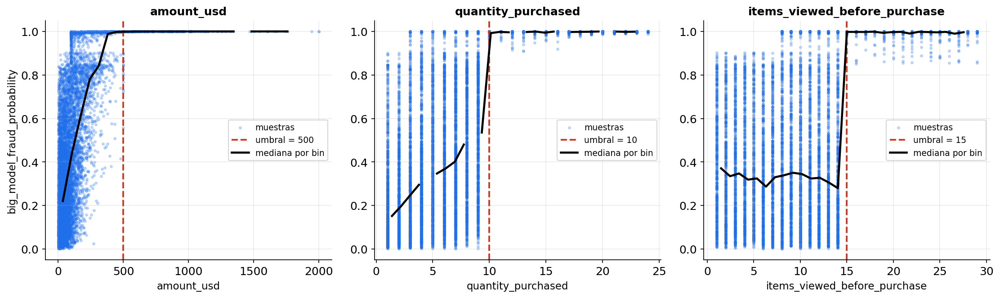

# Estudio de generalización — perceptrón no-lineal (Ej1)
### Generalizacion
> Generalización = qué tan bien el modelo predice en datos que no vio durante el entrenamiento.

Evaluar como se comporta el modelo para predecir datos **que nunca vio**
Para esto dividimos en *training set* y *validation set*; El modelo se entrena con el training set sin nunca ver el validation, y luego se prueban sus predicciones sobre el validation.

Un modelo que memoriza el train set (overfitting) tiene MSE train bajo pero MSE test alto. Un modelo que generaliza tiene MSE similares en ambos.                                            

Para medirlo usamos K-fold cross-validation: entrenamos K veces en particiones distintas y promediamos las métricas de test, así la estimación no depende de una sola división suerte/mala suerte.

**Modelo seleccionado:** perceptrón no-lineal (sigmoide), LR=1e-2, thr*=0.89.
Justificación de la selección: ver `ejercicio1/analisis_comparativo_aprendizaje.md` §2c.

## a) Métricas de evaluación seleccionadas y por qué

Se reportan dos grupos de métricas separadas, con propósitos distintos:

### Grupo 1 — Error de la loss de entrenamiento: MSE

El modelo se entrenó minimizando el MSE contra `big_model_fraud_probability` (output continuo del BigModel). Reportar MSE en train Y en test permite evaluar **si el modelo generaliza**: si MSE_train ≈ MSE_test, el modelo no memorizó el conjunto de entrenamiento.

| Métrica | Para qué sirve |
|---|---|
| MSE train | Qué tan bien ajustó el modelo al conjunto de entrenamiento |
| MSE test | Qué tan bien generaliza a datos no vistos |
| Gap (MSE_test − MSE_train) | Señal directa de overfitting: gap grande → el modelo memoriza |

### Grupo 2 — Métricas de clasificación binaria: Acc / Prec / Rec / F1

La tarea final no es predecir una probabilidad sino **detectar fraude** (binario). Estas métricas evalúan el modelo contra el ground truth (`flagged_fraud`) una vez aplicado el threshold.

| Métrica | Por qué se incluye |
|---|---|
| **Accuracy** | Proporción total de predicciones correctas |
| **Precision** | De los que el modelo marca como fraude, ¿cuántos realmente lo son? Costo de falsos positivos (molestar a clientes legítimos) |
| **Recall** | De los fraudes reales, ¿cuántos detecta el modelo? Costo de falsos negativos (fraudes no detectados) |
| **F1** | Media armónica de precision y recall. Métrica síntesis cuando el dataset está desbalanceado (11.59% fraude) |

Precision y recall responden preguntas de negocio distintas y se contradicen: subir el threshold aumenta precision pero baja recall. Reportar los dos (y F1) es necesario para que CompanyX pueda tomar la decisión de threshold según sus costos.

### Por qué NO reportar una sola métrica

- Accuracy sola es engañosa con clases desbalanceadas: un modelo que predice "no fraude" siempre tiene accuracy = 88.41% (base rate).
- MSE solo no dice si el modelo clasifica bien — sólo si aproxima la probabilidad continua.
- F1 sola depende del threshold y no muestra el tradeoff.

## b) Estrategia de manipulación del conjunto de datos

### Estrategia usada: K-fold CV estratificado (K=5) + multi-seed

El dataset completo (7500 muestras) **nunca se divide en train/test fijo**. En cambio:

1. **K-fold estratificado (K=5):** se divide el dataset en 5 partes manteniendo la proporción de fraude (11.59%) en cada parte. Cada fold usa 6000 muestras para entrenar y 1500 para evaluar. Se rota 5 veces → 5 estimaciones independientes del error de generalización.

2. **Z-score fit-on-train-only:** los parámetros de normalización (media y std por feature) se calculan *sólo sobre el fold de train* y se aplican al fold de test. Esto evita *data leakage*: el modelo no "ve" la escala del test durante el entrenamiento.

3. **Multi-seed (5 seeds):** cada corrida (lr, k) se repite con 5 seeds distintas para controlar el azar de la inicialización de pesos. Resultado: 5 seeds × 5 folds = **25 estimaciones** por configuración, lo que permite separar la variabilidad por inicialización (seed-std) de la variabilidad por partición (fold-std).

### ¿Cómo se elige el mejor conjunto de entrenamiento?

La pregunta no tiene una única respuesta: depende del objetivo.

- **Para evaluar hiperparámetros (LR, threshold):** el mejor conjunto es el que produce las estimaciones más estables → K-fold CV + multi-seed (lo que hicimos).
- **Para el modelo final que se entrega al cliente:** el mejor conjunto de entrenamiento es **el dataset completo** (7500 muestras). Una vez fijados los hiperparámetros con CV, re-entrenar sobre todo el dataset maximiza la información disponible para los pesos finales. No se reserva un test set porque el CV ya dio la estimación de generalización.

Esto es exactamente lo que pide el enunciado: "el estudio se realiza utilizando todas las muestras del conjunto de datos."

### Evidencia de que la estrategia funciona: gap train/test

El scatter muestra las 25 corridas (5 seeds × 5 folds) del modelo ganador. Los puntos se agrupan sobre la diagonal y=x, con gap prácticamente cero:

| Modelo | MSE train (media) | MSE test (media) | Gap medio |
|---|---|---|---|
| Lineal (lr=1e-4) | ~0.02639 | ~0.02658 | +0.00019 |
| No-lineal (lr=1e-2) | ~0.01093 | ~0.01099 | +0.00006 |

Gap ≈ 0 en ambos casos → **sin overfitting**. El modelo no memoriza el train set: lo que aprendió en 6000 muestras aplica igualmente bien a las 1500 que no vio. El error que queda (MSE>0) no es gap train/test sino underfitting: capacidad insuficiente del modelo para la función objetivo.

# Definición del LR óptimo
Ver [[Notas/ejercicio 1/Experimentos y analisis/NON LINEAR perceptron/LR eleccion + experimentacion|LR eleccion + experimentacion]] ;; ***TIENE PLOTS!!***

Experimento: 5 seeds × 3 LRs × 5 folds = 75 entrenamientos. `epochs=500` (suficiente para convergencia segun single-seed). Seeds: [7, 13, 21, 42, 99].

| lr     | thr* | MSE test          | Accuracy        | Precision       | Recall          | F1              | ‖w‖             |
| ------ | ---- | ----------------- | --------------- | --------------- | --------------- | --------------- | --------------- |
| 0.0001 | 0.86 | 0.01128 ± 0.00052 | 0.9712 ± 0.0039 | 0.8877 ± 0.0211 | 0.8605 ± 0.0228 | 0.8737 ± 0.0168 | 1.7510 ± 0.0096 |
| 0.001  | 0.89 | 0.01099 ± 0.00058 | 0.9709 ± 0.0045 | 0.8859 ± 0.0210 | 0.8594 ± 0.0271 | 0.8722 ± 0.0200 | 1.9829 ± 0.0196 |
| 0.01   | 0.89 | 0.01099 ± 0.00058 | 0.9704 ± 0.0044 | 0.8869 ± 0.0201 | 0.8534 ± 0.0277 | 0.8696 ± 0.0200 | 1.9792 ± 0.0195 |
*Extraído del doc de LR:*
LR = 10^-3 y LR = 10^-2 dan resultados practicamente equivalentes. LR = 10^-4 también excepto en MSE se queda levemente atrás. Elegimos LR = 10^-2 que converge mucho mas rapido.

# Definición del K FOLD Óptimo
Ver [[K fold eleccion + experimentacion]] ;; ***TIENE PLOTS!!***

- LR fijo: `1e-2` (ganador del sweep de LR)
- Seed: `42` (seed-std≈0 en el sweep multi-seed → una seed es suficiente)
- Épocas: `500` (suficiente para plateau, ver sweep LR)
- Threshold: `0.89` (thr* del no-lineal — max F1 promedio en el sweep multi-seed de LR)
- K evaluados: [2, 3, 5, 10]
- Estratificado por `flagged_fraud`: sí

| K   | MSE test          | F1              | Precision       | Recall          | Accuracy        |
| --- | ----------------- | --------------- | --------------- | --------------- | --------------- |
| 2   | 0.01096 ± 0.00001 | 0.8713 ± 0.0046 | 0.8862 ± 0.0103 | 0.8573 ± 0.0186 | 0.9707 ± 0.0005 |
| 3   | 0.01097 ± 0.00028 | 0.8716 ± 0.0083 | 0.8880 ± 0.0094 | 0.8562 ± 0.0173 | 0.9708 ± 0.0017 |
| 5   | 0.01099 ± 0.00044 | 0.8724 ± 0.0298 | 0.8872 ± 0.0297 | 0.8585 ± 0.0336 | 0.9709 ± 0.0068 |
| 10  | 0.01099 ± 0.00062 | 0.8708 ± 0.0380 | 0.8867 ± 0.0332 | 0.8561 ± 0.0480 | 0.9707 ± 0.0085 |

**K=5 es el ganador defendible** — entrega:
- bias del estimador chico (entrena con 80%),
- ~174 positivos por fold de validación (suficientes para que las métricas no sean ruidosas por azar de muestreo),
- std de MSE/F1 dentro de lo aceptable,
- 1× el cómputo de K=5 vs 2× de K=10.

# Mejor modelo
**Perceptrón no-lineal**, re-entrenado sobre las 7500 muestras con LR=1e-2, 500 épocas.

Métricas de referencia de la validación (mean ± std sobre 5 seeds × 5 folds, thr*=0.89):

| MSE test          | Accuracy        | Precision       | Recall          | F1              |
| ----------------- | --------------- | --------------- | --------------- | --------------- |
| 0.01099 ± 0.00058 | 0.9709 ± 0.0045 | 0.8859 ± 0.0210 | 0.8594 ± 0.0271 | 0.8724 ± 0.0200 |

# Elección de threshold
El threshold de decisión vive **post-training**: no cambia los pesos del perceptrón, sólo decide cómo binarizar la salida continua. Por eso este sweep no requiere re-entrenar, se reconstruyen las predicciones de cada (lr, seed, fold) a partir de los pesos guardados y se evalúan métricas sobre una grilla densa de thresholds.

| Threshold bajo (ej. 0.70)                  | Threshold alto (ej. 0.95)               |
| ------------------------------------------ | --------------------------------------- |
| Recall sube → más fraudes detectados       | Recall baja → más fraudes perdidos      |
| Precision baja → más falsos positivos      | Precision sube → menos falsos positivos |
| Se interrumpen más transacciones legítimas | Se dejan pasar más fraudes reales       |

**Threshold recomendado: 0.89** (thr* que maximiza F1)

Justificación: F1 es la métrica síntesis que balancea los dos costos. A thr*=0.89:
- Precision ≈ 0.89 → de cada 10 alertas, 9 son fraude real.
- Recall ≈ 0.86 → se detectan el 86% de los fraudes.
- El 14% restante no es detectado (falsos negativos).

**Si CompanyX prioriza no perder fraudes** (recall > precision), se puede bajar el threshold a ~0.80–0.85. Las curvas de threshold están en:
`nonlinear_perceptron/analisis_outputs/sweep_lr/multiseed/threshold_curves.png`
`nonlinear_perceptron/analisis_outputs/sweep_lr/multiseed/pr_curve.png`

La recomendación final de threshold debería venir de CompanyX estimando el costo relativo de un fraude no detectado vs una transacción legítima bloqueada.
# Conclusión final: Comparacion contra el analis del dataset
Como medimos si el modelo ajusta correctamente al problema? Tenemos el MSE. En clase dijeron MSE alto en training set -> underfitting. Pero como juzgamos si un MSE es alto? Cual es la referencia?

Lo que hicimos fue analizar el dataset [[Informe con fotos leeme.pdf]]. Encontramos reglas básicas que dividen el dataset a partir de un umbral en 3 features, y calculamos métricas para el sistema que únicamente hace esta división por umbrales. Los resultados fueron precision=100% / recall=80% / acc=97.68%.

Definimos que hay **underfitting** si el perceptrón en train no iguala (acc ≥ 97.68%, precision ≥ 100% sobre lo que predice, recall ≥  80%).

Al menos, queremos que iguale o mejore el **recall** para considerar que vale la pena usar el perceptron.

| Modelo            | MSE test          | Accuracy        | Precision       | Recall          | F1              |
| ----------------- | ----------------- | --------------- | --------------- | --------------- | --------------- |
| Perceptron lineal | 0.01099 ± 0.00058 | 0.9709 ± 0.0045 | 0.8859 ± 0.0210 | 0.8594 ± 0.0271 | 0.8724 ± 0.0200 |
| Regla estadística |                   | 97.68%          | 100%            | 80%             |                 |

Esas eran las metricas que mas nos preocupaban. 
**Como se comporta el modelo con esas metricas?**

 En este grafico, para cada columna se agrupan las filas por intervalos , y a cada conjunto de filas de un intervalo se le saca la media de probabilidad de fraude. Luego, se hace lo mismo para la prediccion de probabilidad del modelo.