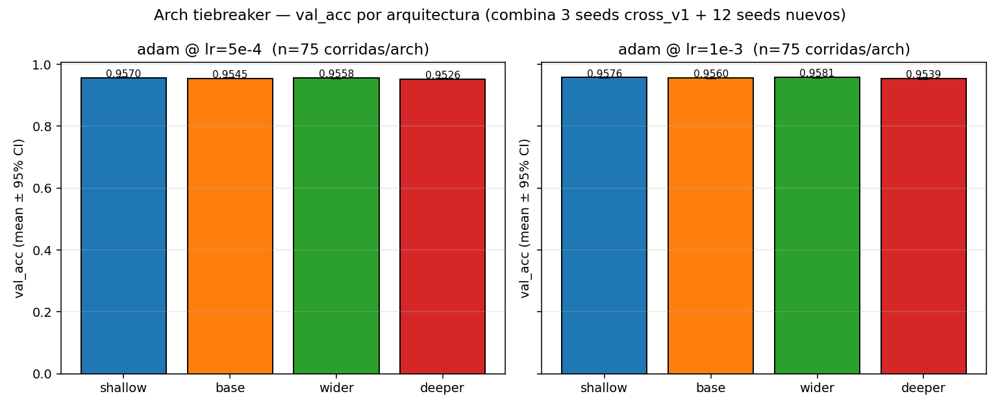

# Arch tiebreaker — alta resolución

## Motivación

En el cross-experiment [`cross_v1` stage 2](../Cross_LR_Opt_Arch/analisis.md), las 4 arquitecturas (`shallow`, `base`, `wider`, `deeper`) se probaron contra 5 LRs × 3 optimizers × 3 seeds × k=5 folds. Las dos cells del top fueron:

| # | arch | opt | LR | val_acc (3 seeds × 5 folds = 15 corridas) |
|---|---|---|---|---|
| 1 | **arch_wider**   | adam | 1e-3 | 0.9583 ± 0.0036 |
| 2 | **arch_shallow** | adam | 1e-3 | 0.9572 ± 0.0041 |

**Problema:** la diferencia entre las dos top es de **0.0011**, comparable al SEM con 15 corridas (~0.0010). Con esa muestra **no podemos distinguir si `wider` realmente le gana a `shallow` o es ruido de muestreo**.

**Por qué importa la decisión:** el [Arch sweep one-at-a-time](../../Experimentos%20y%20analisis/Arch/Arquitectura.md) original había concluido que `shallow` es óptima por Occam. El cross-experiment puso esa conclusión en duda al mostrar que `wider` la supera (al menos numéricamente) en el LR óptimo de Adam. Si la diferencia es real, la "configuración óptima del Ej2" deja de ser shallow + Adam@1e-3 y pasa a ser **wider** + Adam@1e-3. Si no es real, shallow gana por simplicidad. Esto cambia la conclusión final del trabajo.

**Estrategia:** en vez de relanzar todo el cross-experiment con más seeds (caro), **ampliamos la muestra sólo en las 2 cells del top** (más sus equivalentes con LR=5e-4, que también estaban entre las top-4). Con **12 seeds nuevos** sumados a los 3 de cross_v1 → 15 seeds × k=5 = **75 corridas/cell**, SEM ≈ 0.0006. Eso permite distinguir diferencias ≥ 0.0012 al 95% — más fino que la diff observada.

**Test estadístico planeado:** z-score de la diferencia (wider − shallow) en LR=1e-3 con SEM(diff) = √(SEM_w² + SEM_s²). Si |z| > 1.96 → distinguibles al 95%. Si no → empate, decide Occam (shallow).

**Costo del experimento:** 4 archs × 2 LRs × 12 seeds × k=5 = 480 corridas, ~60 min wall-clock con 8 workers — barato comparado al cross_v1 completo (4h44min para 1245 corridas).

## Configuración

| Parámetro | Valor |
|---|---|
| Optimizer | adam (β1=0.9, β2=0.999, ε=1e-8) |
| LRs probados | 5e-4, 1e-3 |
| Batch size | 16 (para LR=5e-4), 64 (para LR=1e-3) — heredado de cross_v1 best_batch |
| Arquitecturas | shallow, base, wider, deeper |
| Seeds NUEVOS | [1, 2, 3, 5, 8, 11, 17, 23, 31, 41, 53, 67] (12) |
| Seeds heredados de cross_v1 | [42, 7, 13] (3) |
| Total seeds combinados | 15 → 75 corridas/cell con k=5 |
| k-folds | 5 estratificado |
| max_epochs | 40 |
| patience | 20 sobre val_loss |
| Loss | cross_entropy |
| Preprocessing | zscore + one-hot |
| Regularización | ninguna |

## Resultados — combinando 3 seeds previos + 12 nuevos = 15 seeds × 5 folds = 75 corridas/cell

SEM ≈ std/√75 ≈ std/8.66 → con std~0.005, SEM ≈ 0.0006. Distingue diffs ≥0.0012 al 95%.

| arch | LR | val_acc mean | std | **SEM** | macro_f1 | val_loss | best_epoch | n |
|---|---|---|---|---|---|---|---|---|
| arch_base | 5e-4 | **0.9545** | 0.0051 | 0.0006 | 0.8492 ± 0.0063 | 0.1733 | 2.8 | 75 |
| arch_base | 1e-3 | **0.9560** | 0.0050 | 0.0006 | 0.8503 ± 0.0060 | 0.1715 | 3.6 | 75 |
| arch_deeper | 5e-4 | **0.9526** | 0.0047 | 0.0005 | 0.8469 ± 0.0061 | 0.1843 | 2.5 | 75 |
| arch_deeper | 1e-3 | **0.9539** | 0.0058 | 0.0007 | 0.8484 ± 0.0071 | 0.1828 | 3.3 | 75 |
| arch_shallow | 5e-4 | **0.9570** | 0.0044 | 0.0005 | 0.8523 ± 0.0058 | 0.1683 | 4.6 | 75 |
| arch_shallow | 1e-3 | **0.9576** | 0.0036 | 0.0004 | 0.8530 ± 0.0052 | 0.1686 | 5.6 | 75 |
| arch_wider | 5e-4 | **0.9558** | 0.0048 | 0.0006 | 0.8509 ± 0.0061 | 0.1747 | 2.4 | 75 |
| arch_wider | 1e-3 | **0.9581** | 0.0049 | 0.0006 | 0.8537 ± 0.0058 | 0.1696 | 3.3 | 75 |

## Conclusión

**Ganador del tiebreaker:** `arch_wider` + adam + LR=`1e-3`

- val_acc: 0.9581 ± 0.0049 (SEM=0.0006)
- macro_f1: 0.8537

### wider vs shallow (LR=1e-3)

- diff = +0.0005
- SEM(diff) = 0.0007
- z-score ≈ 0.65  → NO distinguibles al 95% (queda empate aún con 15 seeds)

## Limitaciones

- Sólo se midió Adam con LR ∈ {5e-4, 1e-3}, batch heredado de cross_v1. No se varió nada más.
- Las 3 seeds de cross_v1 corrieron con `max_epochs` heredado de la auditoría (40); las 12 nuevas usan los mismos parámetros — son combinables directamente.
- Si el resultado es 'no distinguibles', la elección final se decide por Occam (el modelo más chico) o por otros criterios (val_loss, best_epoch, tiempo).
