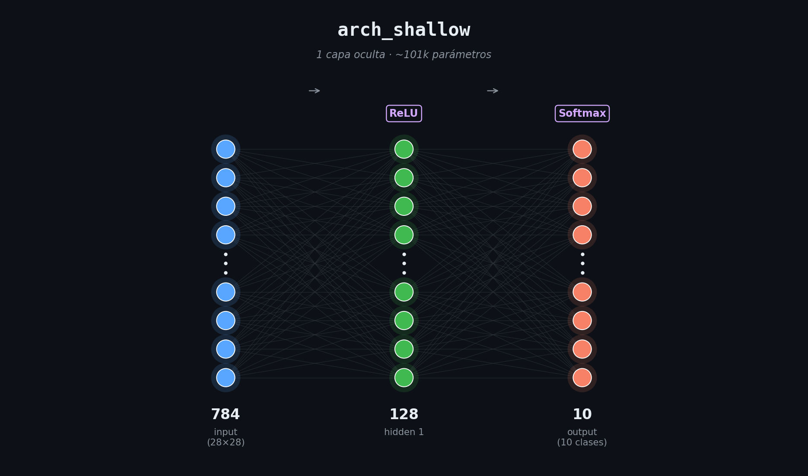
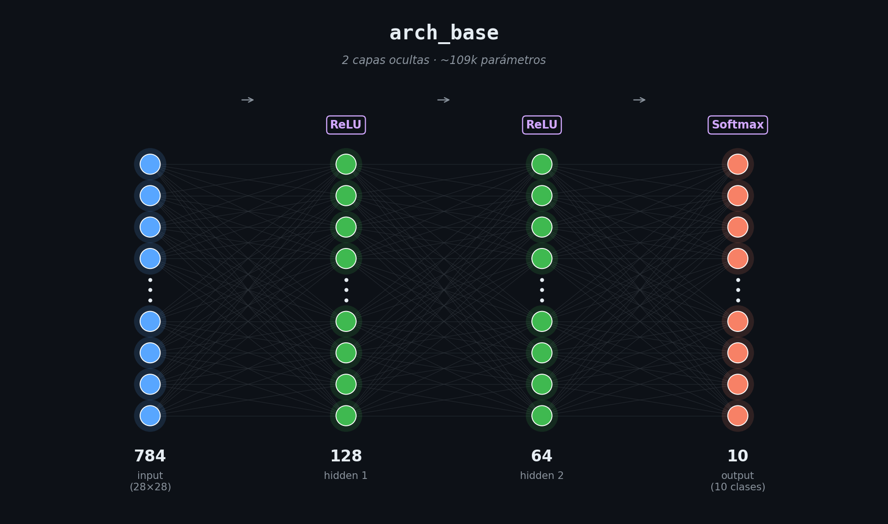
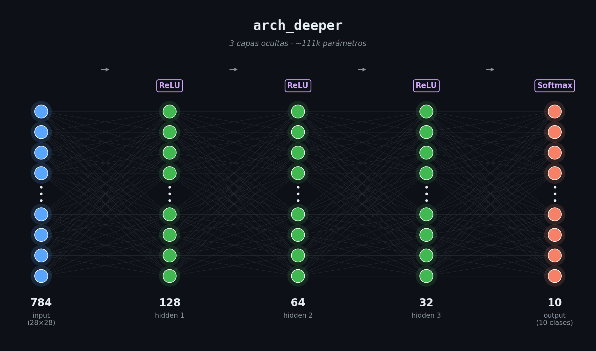
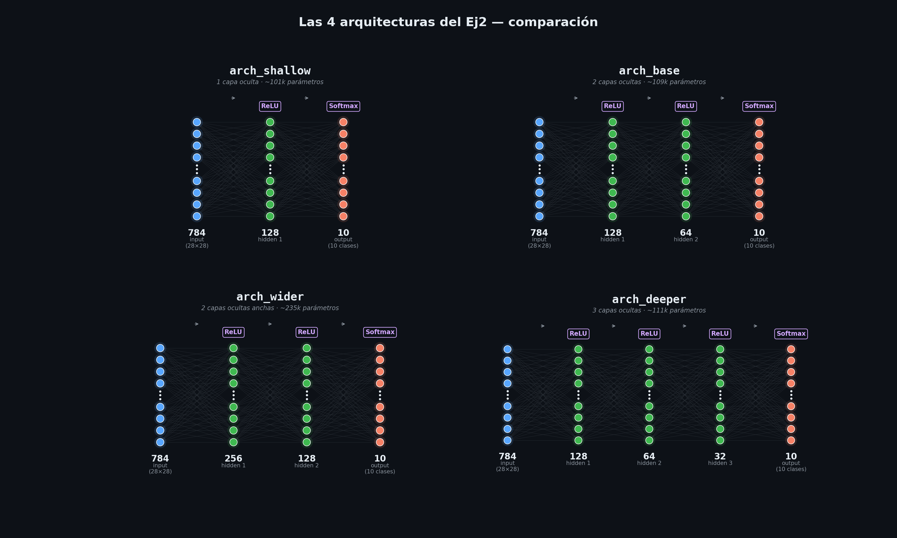
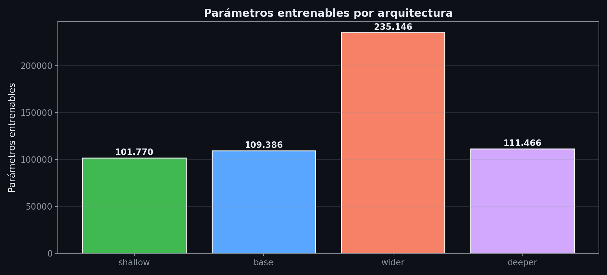

# Las 4 arquitecturas del Ej2 — visualización

Visualización de las 4 redes que probamos en el Ej2 para clasificar dígitos manuscritos. Cada diagrama muestra **cómo fluye una imagen de 28×28 píxeles** desde la entrada hasta la predicción final de las 10 clases.

> **Cómo leer los diagramas:**
> - Cada **círculo es una neurona**. Las capas con muchas neuronas (como la entrada de 784) se dibujan colapsadas (los puntitos en el medio significan "...y así para todas las que faltan").
> - Las **líneas grises de fondo** son las conexiones entre cada neurona y la siguiente capa — todas con todas (fully connected).
> - **Azul = input**, **verde = hidden**, **naranja = output**.
> - Las **etiquetas violetas arriba** son la función de activación de esa capa.
> - El **número grande debajo** de cada capa es la cantidad de neuronas.

---

## El input — siempre el mismo

Las 4 arquitecturas reciben **lo mismo**: una imagen del dataset `digits.csv` de **28 × 28 = 784 píxeles**, ya aplanada a un vector de 784 valores en [0, 1] (z-score aplicado en el preprocessing). Cada píxel entra a una neurona del input.

## El output — también igual

Las 4 terminan en una capa de **10 neuronas con softmax**, una por dígito (0-9). El softmax garantiza que la salida sea una distribución de probabilidad: las 10 valores suman 1 y la predicción final es `argmax`. Esto es lo que pide la [clase de optimizadores](../../docs/clase_optimizadores/clase%20optimizadores.pdf) cuando se entrena con cross-entropy en multiclase.

**Lo que cambia entre las 4 es la "tubería" del medio** — cuántas capas ocultas, qué tan anchas. Eso es lo que controla la **capacidad** del modelo.

---

## 1. `arch_shallow` — la simple



```
784 (input) → 128 (ReLU) → 10 (Softmax)
```

**1 sola capa oculta** de 128 neuronas con ReLU. ~101k parámetros entrenables.

**La idea:** la red toma el vector de 784 píxeles, lo proyecta a un espacio intermedio de 128 features (donde cada neurona aprende a detectar algún patrón visual), y desde ahí decide directamente la clase. Es el MLP más mínimo que puede resolver el problema.

**¿Por qué funciona tan bien?** Porque el dataset de dígitos es relativamente "fácil" para una red con 100k+ parámetros: 8000 ejemplos de imágenes pequeñas y bastante limpias. Una sola capa oculta ya tiene capacidad de sobra para aprenderlo.

**Resultado en cross_v1 + tiebreaker:** `val_acc ≈ 0.957` — la mejor por Occam (mismo rendimiento que `wider` con la mitad de parámetros).

---

## 2. `arch_base` — la clásica



```
784 (input) → 128 (ReLU) → 64 (ReLU) → 10 (Softmax)
```

**2 capas ocultas** decrecientes (128 → 64). ~109k parámetros (sólo 8k más que shallow).

**La idea:** el patrón "embudo" clásico de los MLPs. La primera capa proyecta a 128 features genéricas, la segunda las combina en 64 features de mayor nivel, y la salida usa esas 64 para decidir. La intuición clásica de los libros de NN: cada capa aprende abstracciones progresivamente más altas.

**Spoiler de la teoría:** para problemas como dígitos, esa "intuición de jerarquía" no se materializa en una mejora medible. Al final tiene casi los mismos parámetros que shallow (porque la 2a capa chica suma poco peso) y rinde casi igual.

**Resultado:** `val_acc ≈ 0.955`. Empata con shallow estadísticamente.

---

## 3. `arch_wider` — la grande


```
784 (input) → 256 (ReLU) → 128 (ReLU) → 10 (Softmax)
```

**2 capas ocultas anchas** (256 → 128). ~235k parámetros — **más del doble que shallow**.

**La idea:** "más capacidad permite aprender funciones más complejas". Si shallow llegaba a 0.957, wider con el doble de parámetros debería llegar más alto, ¿no?

**Lo que pasa en realidad:**
- En `Adam@LR=1e-3` queda con `val_acc ≈ 0.958` — **casi idéntico a shallow**, no a 0.97.
- En `Adam@LR=1e-2` (LR alto) **colapsa a 0.945**, último puesto. Más capacidad = más sensibilidad al LR alto. Ver detalle en [`IMPORTANTE_CORRELACIONES.md`](../Primera%20tanda%20de%20experimentos/IMPORTANTE_CORRELACIONES.md).

**Lección:** en este problema, **la capacidad NO es el cuello de botella**. Agregar parámetros no agrega rendimiento, sólo hace al modelo más sensible a otros hiperparámetros.

---

## 4. `arch_deeper` — la profunda



```
784 (input) → 128 (ReLU) → 64 (ReLU) → 32 (ReLU) → 10 (Softmax)
```

**3 capas ocultas** decrecientes (128 → 64 → 32). ~111k parámetros, solo levemente más que base.

**La idea:** profundidad > ancho. La razón clásica: cada capa adicional permite construir representaciones más abstractas. En CNNs profundas (ResNet, etc.) esta intuición funciona — pero esas redes usan trucos como batch-norm y skip connections.

**Lo que pasa en MLP vainilla con 3 capas ReLU:**
- Sin batch-norm, sin residuals, los gradientes empiezan a tener problemas de propagación a través de las 3 capas.
- `val_acc ≈ 0.952` — **el peor de los 4**, con la mayor varianza entre seeds.

**Lección:** profundidad sin las herramientas modernas (batch-norm, etc.) **no compensa**. Es un caso libro-de-texto del problema que motivó esos trucos en la literatura.

---

## Comparación lado a lado



Pasame el ojo por las 4: el input (azul, 784) y el output (naranja, 10) son **idénticos**. Lo único que cambia es **la columna verde del medio** — su altura (cantidad de capas) y su grosor (neuronas por capa).

---

## Cantidad de parámetros entrenables



| Arquitectura | Capas ocultas | Parámetros | Lectura |
|---|---:|---:|---|
| **shallow** | 1 | **101.770** | Mínimo viable. 100k. |
| **base** | 2 | **109.386** | +8k vs shallow (la 2a capa chica suma poco). |
| **deeper** | 3 | **111.466** | +2k vs base. La 3a capa de 32 neuronas casi no agrega peso. |
| **wider** | 2 | **235.146** | **2.3× más que shallow**. La 1a capa de 256 es la dominante. |

**Observación clave:** `wider` es el único que duplica los parámetros. `base` y `deeper` agregan capas pero **no capacidad real** porque las capas adicionales son cada vez más chicas. Este es exactamente el motivo por el cual `base` y `deeper` no superan a `shallow`: tener más capas no compensa si esas capas son tan chicas que no agregan parámetros — y si son grandes (como wider), el problema deja de ser falta de capacidad y pasa a ser lo que vimos: sensibilidad a otros HP.

---

## Cómo se calculan los parámetros

Para una capa fully connected con `n_in` entradas y `n_out` neuronas:

```
parámetros = n_in × n_out  (pesos)  +  n_out  (biases)
            = n_out × (n_in + 1)
```

Ejemplo, `arch_shallow`:
- Capa 1 (input → hidden): 128 × (784 + 1) = **100.480**
- Capa 2 (hidden → output): 10 × (128 + 1) = **1.290**
- **Total: 101.770** ✓

---

## Por qué probamos estas 4 (y no otras)

El [arch sweep original](../Primera%20tanda%20de%20experimentos/Arch/Arquitectura.md) eligió estos 4 puntos para responder 3 preguntas concretas que la teoría predice:

1. **¿Hace falta profundidad?** → `shallow` (1 hidden) vs el resto.
2. **¿Hace falta ancho?** → `wider` (256 en la 1a) vs `base` (128 en la 1a).
3. **¿Más capas profundas con menos neuronas ayuda?** → `deeper` (3 capas decrecientes) vs `base` (2 capas).

**Las respuestas, según [cross_v1](../Segunda%20tanda%20de%20experimentos/Cross_LR_Opt_Arch/analisis.md) + [tiebreaker](../Segunda%20tanda%20de%20experimentos/Arch_tiebreaker/analisis.md):**

1. **No** — shallow rinde igual que las profundas en este problema.
2. **No** — wider y base están en empate estadístico.
3. **No** — deeper es la peor.

→ **Ganador final: `arch_shallow`** por navaja de Occam (mismo rendimiento, menos complejidad).

---

## Notas técnicas (para defensa oral)

**Inicialización:** todas las capas ReLU usan **He init** (`auto` selecciona He cuando detecta ReLU). El factor √(2/n_in) es lo que garantiza que la varianza de las activaciones se mantenga estable a través de las capas — clave para evitar vanishing/exploding gradients en profundas.

**Por qué softmax + cross-entropy juntos:** la combinación es estable numéricamente porque el log de softmax cancela los exp's. En `mlp/losses.py` están implementados como un par para evitar overflow. Ver [clase de optimizadores].

**Por qué z-score y no min-max:** en cualquier MLP con ReLU + He init, z-score (media 0, std 1) preserva mejor la asunción del init sobre la distribución de las entradas. Min-max [0,1] sesga las activaciones a ser todas positivas en la primera capa, lo que rompe la simetría del He init para ReLU.

---

## Generar los diagramas

```bash
python "Notas/ejercicio 2/visualizacion arquitecturas/make_arch_diagrams.py"
```

Genera los 4 PNGs individuales + comparación + bar chart de parámetros, todos en `Notas/ejercicio 2/visualizacion arquitecturas/`.
