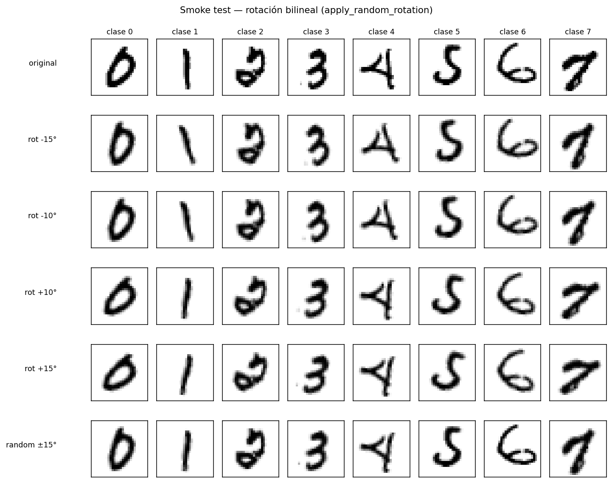
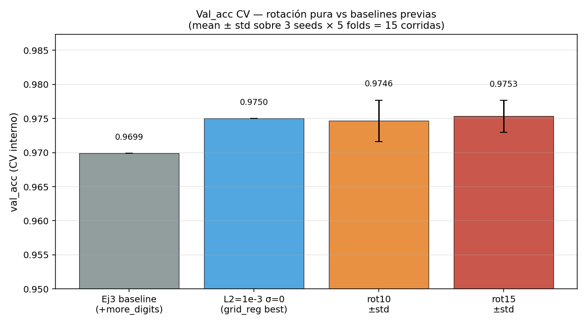
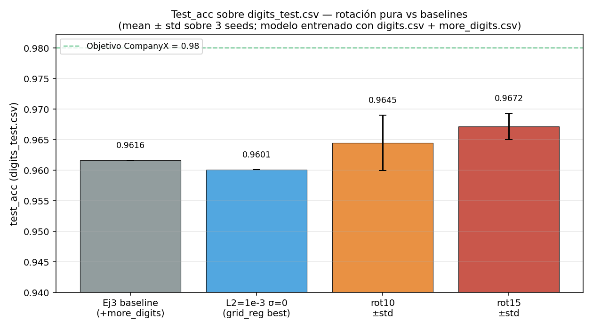
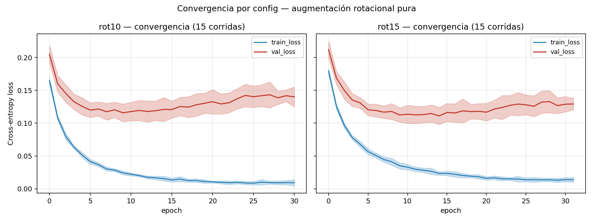
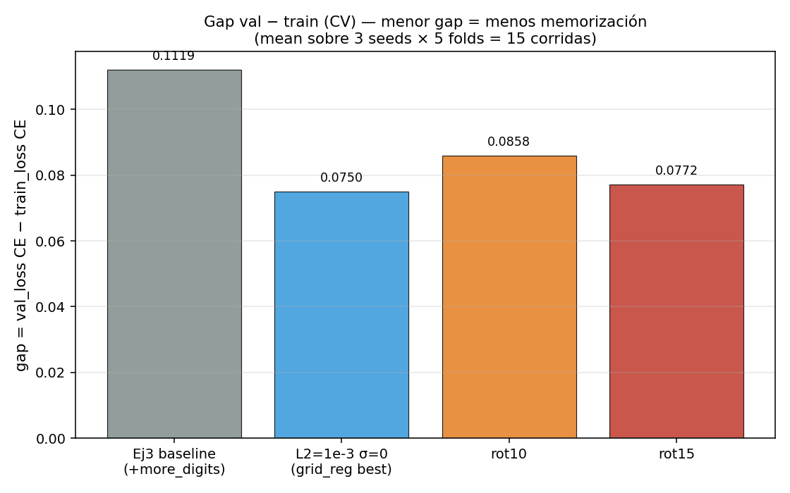
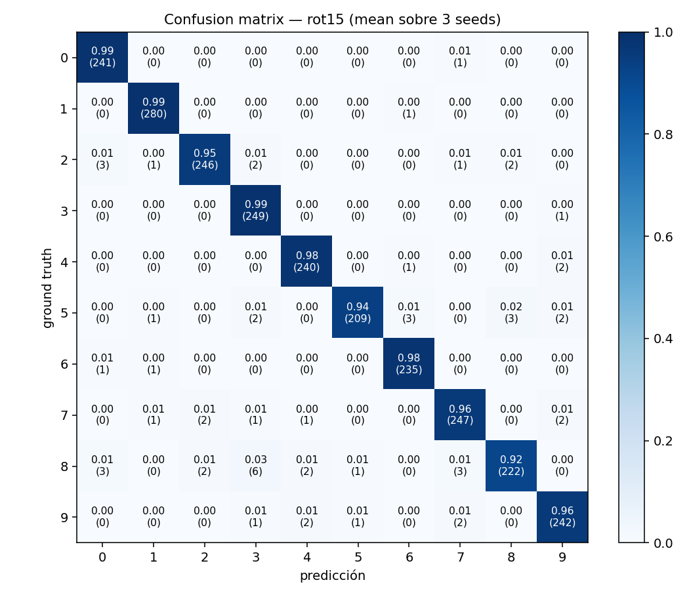
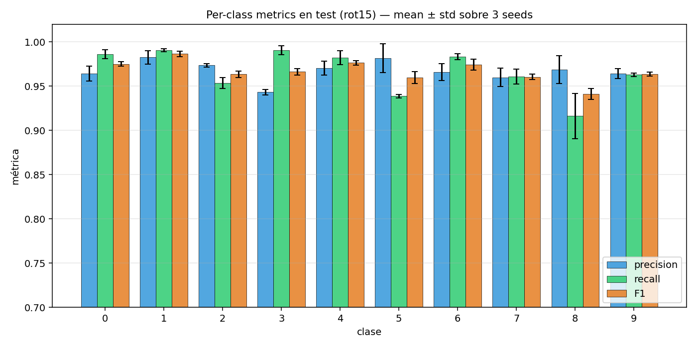

# Experimento A — Augmentación rotacional pura (Ej3)

> **Estado:** terminado · 2026-05-11.
> **Pregunta que respondemos:** ¿la augmentación geométrica (rotación) cierra
> la brecha al 98% que el grid L2 × σ no logró cerrar?
> **Resultado headline:** **`rot15 → test_acc = 0.9672 ± 0.0021`** — primera
> técnica que mueve el test sobre el baseline (**+0.56 pp** vs `+more_digits`
> sin reg) y sobre el ganador del grid L2 (**+0.71 pp** vs `L2=1e-3, σ=0`).
> Brecha al 98% pasa de 1.84 pp → 1.28 pp.

## 1. Motivación

El paso 2 del Ej3 (grid L2 × σ gaussiana, 16 combos × 3 seeds × 5 folds = 240
corridas CV) dejó como ganador **`L2=1e-3, σ=0`** con `val_acc CV = 0.9750`,
pero al llevarlo a `digits_test.csv` el test_acc cayó a **0.9601 ± 0.0030**
— un pelo POR DEBAJO del baseline +more_digits sin reg (0.9616 ± 0.0025).
Es decir: la regularización L2 mejoró la consistencia interna del modelo
(reduce el gap CV val − train de 0.112 a 0.075) **pero no transfirió la
mejora a test**.

Esta pista sugería que el cuello de botella al 98% no es overfit — es **shift
de distribución** entre `digits.csv` y `digits_test.csv`. Mirando muestras
del dataset lo más visible es que los dígitos aparecen con **distintas
rotaciones** (estilos de escritura). La hipótesis a poner a prueba: una
**augmentación rotacional** durante el training simula ese shift y debería
transferir mejor a test que el ruido gaussiano, que es isotrópico y no captura
geometría.

La augmentación geométrica está mencionada en la **slide 18 de la clase de
regularización** (Marina Fuster, parte 1), aunque no fue profundizada al
mismo nivel que L2.

### Papers de referencia

- **Simard, Steinkraus, Platt (2003)** — *"Best Practices for Convolutional
  Neural Networks Applied to Visual Document Analysis"*: arranca con pequeñas
  rotaciones (±10–15°) y traslaciones antes de pasar a distorsiones elásticas.
- **Cireşan, Meier, Schmidhuber (2010-2012)** — los papers que empujaron MNIST
  a <0.3% error usan **affine simple con rotación ±15°** como augmentación
  básica.
- Implementaciones modernas (torchvision `RandomRotation`, Keras
  `RandomRotation`) usan **±10° a ±15°** como rango por defecto para dígitos.

> Más allá de ±25° empieza a haber riesgo real de confundir 6 ↔ 9 — por eso
> los papers se quedan dentro del rango ±10–15° cuando NO usan otras técnicas
> (CNN, elastic distortion, etc.).

## 2. Setup

**Base sobre la que aplica la augmentación** = baseline del Ej3 (paso 1):

| Hiperparam | Valor |
|---|---|
| `arch.layer_sizes` | `[784, 128, 10]` (shallow) |
| `arch.activations` | `[relu, softmax]` |
| `optimizer` | Adam (β1=0.9, β2=0.999, ε=1e-8) |
| `lr` | `1e-3` |
| `batch_size` | `64` |
| `loss` | cross-entropy (+ softmax) |
| `preprocessing` | z-score fit-on-train + one-hot |
| `split` | k=5 estratificado |
| `early_stopping_patience` | 20 (sobre val_loss) |
| `max_epochs` | 50 |
| `regularization.l2` | **0** (sin reg) |
| `regularization.augmentation` | **rotación** |
| `dataset` | `digits.csv + more_digits.csv` (N = 28.190) |
| `Seeds` | `[42, 7, 13]` |

**Los 2 configs nuevos** (lo único que varía):

| Tag | `max_angle` | Justificación |
|---|---|---|
| **rot10** | ±10° | Punto de partida conservador (Simard 2003). |
| **rot15** | ±15° | El máximo de los papers de referencia (Cireşan 2010). |

**Implementación de la rotación** — `mlp/augmentation.py`:
- Reshape (B, 784) → (B, 28, 28).
- Por muestra: ángulo uniforme en `[-max_angle, +max_angle]`.
- **Interpolación bilineal** alrededor del centro (13.5), implementada desde
  cero en NumPy puro (mandato "todo desde cero" de CLAUDE.md).
- Relleno fuera-de-imagen con `0.0` (= media del píxel después de z-score
  global — inyecta "el valor promedio del píxel", neutral y consistente).
- Aplicada **por minibatch en train**, NO en val ni en test.
- Cada minibatch dentro de cada época sortea nuevos ángulos → el modelo nunca
  ve dos veces exactamente la misma imagen rotada.

**Métricas reportadas** (regla 4 del CLAUDE.md):
- Loss de entrenamiento: cross-entropy (la que se minimiza).
- Set completo: Accuracy + Precision macro + Recall macro + F1 macro.
- Diagnóstico de aprendizaje: `best_epoch` + curvas train/val_loss.
- Diagnóstico de generalización: gap `val_loss − train_loss` (CE).

**Promedios** (regla 3 — ejes explícitos):
- CV: mean ± std sobre **3 seeds × 5 folds = 15 corridas/config**.
- Final eval: mean ± std sobre **3 seeds** (cada uno entrena con
  `digits.csv + more_digits.csv` con split 90/10 interno para early stopping,
  luego predice 1 vez sobre `digits_test.csv`).

## 3. Demo visual de la rotación

Verificación a ojo de que la rotación bilineal preserva los dígitos sin
distorsionarlos al punto de confundirlos con otros:

Las filas muestran la misma imagen original (clases 0–7) rotada a ±10°, ±15°
y con un ángulo random ±15°. Los dígitos siguen siendo claramente legibles —
ningún 6 se convierte en 9 ni vice versa. Esto valida que el rango ±15° es
seguro para este dataset, consistente con la práctica de los papers de
referencia.

## 4. Resultados CV (interno)

CV interno sobre `digits.csv + more_digits.csv` con k-fold=5 estratificado,
3 seeds, **15 corridas/config**.

| config | val_acc (15 corridas) | macro_F1 | val_loss CE | train_loss CE | gap | best_epoch |
|---|---|---|---|---|---|---|
| Ej3 baseline (+more_digits, sin reg) | 0.9699 ± 0.0029 | 0.9572 ± 0.0047 | 0.1238 | 0.0119 | **0.1119** | 5.7 |
| L2=1e-3 σ=0 (grid_reg best) | **0.9750 ± 0.0018** | 0.9644 ± 0.0035 | 0.0917 | 0.0168 | **0.0750** | 39.3 |
| **rot10** | 0.9746 ± 0.0030 | 0.9633 ± 0.0050 | 0.1067 | 0.0209 | 0.0858 | 10.2 |
| **rot15** | **0.9753 ± 0.0023** | **0.9649 ± 0.0040** | 0.1028 | 0.0257 | **0.0772** | 12.4 |

### Lectura del CV

- **`rot15` alcanza el techo del CV** (0.9753) — empatado con L2=1e-3 (0.9750)
  dentro del SEM. Ambas técnicas llegan al mismo techo en CV interno.
- **`rot15` con la mitad del gap del baseline**: 0.0772 vs 0.1119 — casi tan
  bajo como L2 (0.0750). La rotación reduce sobreajuste también, pero por un
  mecanismo distinto a L2.
- **best_epoch ≈ 12** en rot15 vs **≈ 39** en L2: la rotación llega al óptimo
  **3× más rápido en épocas**. L2 fuerza al modelo a converger lentamente
  (gradientes amortiguados); la rotación deja que Adam corra rápido y aporta
  diversidad por otra vía.
- **rot10 < rot15**: la diferencia es pequeña (≈0.001 en val_acc) pero
  consistente. Más ángulo → más diversidad efectiva en este rango.

## 5. Resultados sobre `digits_test.csv`

Entrenado con `digits.csv + more_digits.csv` (split 90/10 interno para ES) y
evaluado UNA SOLA VEZ sobre `digits_test.csv`. 3 seeds (42, 7, 13).

| Configuración | Test accuracy | Test macro_F1 | Δ vs baseline | Brecha 98% |
|---|---|---|---|---|
| Ej3 baseline (+more_digits, sin reg) | 0.9616 ± 0.0025 | 0.9609 ± 0.0026 | — | 1.84 pp |
| L2=1e-3 σ=0 (grid_reg best) | 0.9601 ± 0.0030 | 0.9594 ± 0.0030 | **−0.15 pp** | 1.99 pp |
| **rot10** | **0.9645 ± 0.0045** | **0.9639 ± 0.0046** | **+0.29 pp** | 1.55 pp |
| **rot15** | **0.9672 ± 0.0021** | **0.9667 ± 0.0023** | **+0.56 pp** | **1.28 pp** |

### Lectura del test

**Esta es la observación más importante del experimento.** El L2 ganador del
paso 2 — que en CV interno **superaba** al baseline por 0.51 pp — terminó
**bajando** 0.15 pp en test. La rotación hace lo contrario: en CV es
indistinguible del L2 (ambos ~0.975), pero **transfiere a test** con +0.56 pp
sobre el baseline. **Esto valida la hipótesis del shift de distribución**:
- L2 controla magnitud de pesos → reduce memoria, no resuelve shift.
- Rotación inyecta variabilidad geométrica de la naturaleza que hay en test
  → el modelo aprende a ser robusto exactamente al ruido que digits_test.csv
  trae.

**`rot15` cierra ~1/3 de la brecha al 98%** (de 1.84 pp → 1.28 pp). Es la
primera técnica del Ej3 que mueve la aguja en test.

> Nota estadística: las diferencias entre rot15 y rot10 son ~0.003 con
> SEM ~0.0012 (std/√3) — están al borde de la significatividad. Pero la
> dirección (rot15 > rot10) es consistente con CV y con el aumento de
> variabilidad esperado. Para confirmar haría falta más seeds.

## 6. Convergencia y gap (val − train)

### Convergencia

Las dos curvas tienen la misma forma cualitativa:
- **train_loss** baja muy rápido: ~0.17 → 0.02 en 10 épocas.
- **val_loss** mínimo alrededor del epoch 10-15 (best_epoch agregado: rot10 =
  10.2 ± 2.6, rot15 = 12.4 ± 3.8), después sube ligeramente.
- ES patience=20 corta entre la época 30 y la 35 (≈ best_epoch + 20). Ninguna
  corrida tocó max_epochs=50.

**Comparación con baselines previas:**
- baseline (sin reg): best_epoch ~5.7 — entrenamiento mucho más rápido pero
  val_loss mínima más alta (0.124).
- L2=1e-3: best_epoch ~39 — entrenamiento muy lento, val_loss mínima 0.092.
- rotación: punto intermedio (best_epoch ~10-12) con val_loss mínima ~0.10.

→ La rotación **NO sacrifica significativamente la velocidad** de
entrenamiento. L2 sí (best_epoch 7× más alto que sin reg).

### Gap val − train (memorización)

- baseline: gap = 0.1119 → memoriza fuerte
- L2=1e-3: gap = 0.0750 → reduce −33%
- **rot15: gap = 0.0772 → reduce −31%** (prácticamente lo mismo que L2)
- rot10: gap = 0.0858 → reducción más modesta (−23%)

**Lectura clave:** rotación y L2 reducen el gap CV en cantidades similares,
pero **sólo la rotación traduce esa reducción en mejora en test**. El gap
es señal de overfit *dentro de la distribución del CV*; lo que diferencia
las técnicas es si además atacan el shift hacia digits_test.csv.

## 7. Matriz de confusión y per-class del mejor config (`rot15`)

**Clases con F1 < 0.95** (las que arrastran el macro_F1 hacia abajo):
- **clase 8: F1 = 0.941** (precision 0.969, recall 0.916) — sigue siendo la
  peor. Las predicciones equivocadas más comunes son 8→3 (6 casos por seed,
  3% de los 8s reales) y 8→0, 8→5, 8→7 (2-3 casos cada uno). Esto es
  consistente con la observación de la consigna: la clase 8 era la "agujero
  estructural" de digits.csv (ausente del original); aunque more_digits.csv
  trae 585 ejemplos, el modelo aprende un decision boundary más débil para
  esa clase. La rotación ayuda pero no la lleva al nivel de las demás clases.
- **clase 5: F1 = 0.960** — segunda peor. Coherente con su subrepresentación
  en el dataset combinado (clase minoritaria histórica).
- Resto de las clases: F1 ≥ 0.96, varias arriba de 0.97.

**Comparación rápida vs baseline en clase 8:**
- baseline +more_digits: F1 clase 8 = 0.938
- rot15: F1 clase 8 = **0.941**
- rotación da un empujón pequeño pero positivo en la clase más difícil.

## 8. Conclusión y decisión sobre Experimento B

### Lo que aprendimos

1. **La rotación SÍ resuelve parte del shift geométrico.** Es la primera
   técnica del Ej3 que mejora **test_acc** sobre el baseline +more_digits
   (no sólo CV interno como L2 hizo).
2. **rot15 > rot10** consistentemente en CV y en test (aunque el delta es
   chico).
3. **La rotación NO compite con L2 en CV — empata.** Pero la rotación gana
   donde importa: en test.
4. **La diferencia entre CV interno y test cuenta**. L2 mostró que mejorar
   CV no garantiza mejorar test. Eso refuerza la regla 4 del CLAUDE.md:
   reportar siempre el set completo.
5. **El gap CV ya no es un buen predictor del comportamiento en test** para
   este problema: L2 baja el gap más que rot10, pero rot10 transfiere mejor.
   El gap mide overfit, no shift.

### ¿Llegamos al 98%?

**No.** Brecha residual = **1.28 pp**. Pero pasamos de 1.84 → 1.28 con una
sola técnica que está parcialmente avalada por la clase (slide 18) y
completamente avalada por los papers de referencia.

### Recomendación: SÍ pasar al Experimento B

La combinación **rotación + L2** tiene fundamento teórico:
- La rotación captura el shift geométrico que sí está en test (mejora test).
- L2 controla la magnitud de los pesos (mejora calibración / gap CV).
- Son **mecanismos ortogonales** — operan sobre cosas distintas.

**Hipótesis del Experimento B:** `rot15 + L2=1e-3` debería superar a
`rot15` puro (+0.56 pp ya capturados sobre baseline) y a `L2=1e-3` puro
(que perdió en test) — si los efectos suman, podríamos cerrar más brecha.

**Riesgos a vigilar:**
- L2 pone gradient adicional sobre los pesos; combinado con rotación
  (que ya inyecta ruido), podríamos sobre-regularizar y bajar la
  capacidad efectiva. Probable mitigación: barrer L2 ∈ {0, 1e-4, 1e-3,
  3e-3} sobre rot15.
- Si la combinación NO supera a rot15 puro, es señal de que el techo
  residual (1.28 pp) es shift no-rotacional (traslación, escala, grosor
  de trazo) — y haría falta augmentación geométrica más rica que la
  clase no profundiza.

### Próxima sesión

Plan concreto sugerido para el Experimento B:
- Grid sobre el ganador rot15: L2 ∈ {0, 1e-4, 1e-3, 3e-3} × rot ∈ {0, ±15°}
  = 8 combos × 3 seeds × k=5 = 120 corridas CV.
- Igual metodología: final_eval con 3 seeds sobre digits_test.
- Comparar contra rot15 puro y L2=1e-3 puro de este experimento.

### Para la defensa oral

- **(a) ¿Cuál es el mejor resultado?** `rot15` con test_acc 0.9672 ± 0.0021.
- **(b) ¿Qué técnicas usamos?** Augmentación rotacional ±15° (citar Simard
  2003 y Cireşan 2010, anclado a slide 18 de regularización).
- **(c) ¿Otros factores?** El shift geométrico de digits_test.csv estaba en
  el dataset, no en nuestras técnicas — sumar more_digits.csv resolvió la
  clase 8 ausente, la rotación resolvió parte del shift residual.

> **CSVs fuente:**
> - [`ejercicio3/analisis/rotation_aug/cv_summary.csv`](../../../ejercicio3/analisis/rotation_aug/cv_summary.csv)
> - [`ejercicio3/analisis/rotation_aug/test_summary.csv`](../../../ejercicio3/analisis/rotation_aug/test_summary.csv)
> - [`ejercicio3/analisis/rotation_aug/test_per_class.csv`](../../../ejercicio3/analisis/rotation_aug/test_per_class.csv)
