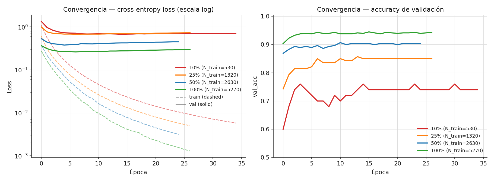
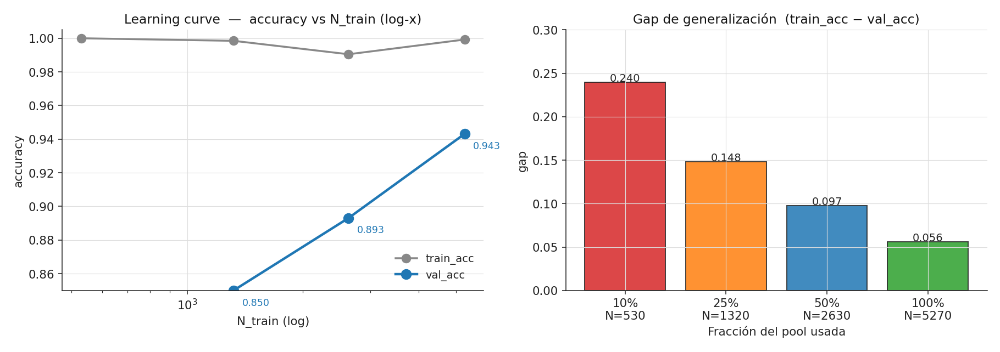
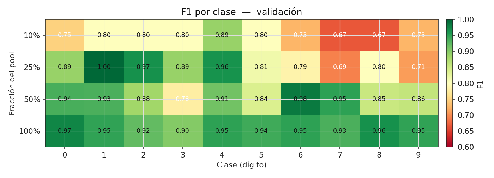
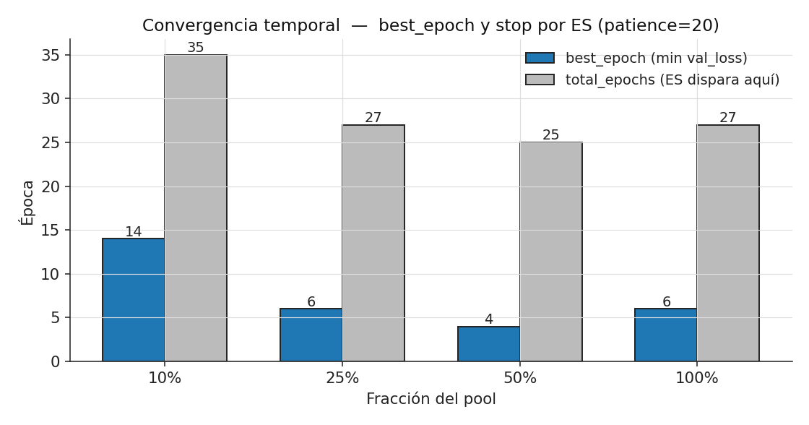

# Testing innovador — Datasets balanceados de tamaño limitado

**Fecha:** 2026-05-11 · **Ejercicio:** Ej2 (MNIST/digits) · **Modelo:** config óptima `final_config_ej2.json` · **Replicación:** 1 seed (sin promedio entre seeds — declarado abajo).

---

## 1. Pregunta y diseño

> **¿Cómo se degrada el MLP óptimo cuando entrenamos con datasets pequeños pero perfectamente balanceados por clase?**

A diferencia del Ej2 estándar (que usa `digits.csv` con sus proporciones naturales), acá:

1. **Pool concatenado** = `digits.csv` + `more_digits.csv` → **28 190 filas, 10 clases**.
   - `digits.csv` **no contiene la clase 8**; sólo 9 dígitos. `more_digits.csv` aporta la clase 8.
   - El pool resulta **muy desbalanceado**: clase 1 = 3 707, clase 8 = **585** (≈ 6× menos).

2. **Subsampling BALANCEADO**. La clase minoritaria (8) pone el techo: el máximo posible *sin sobremuestrear* es **585 por clase × 10 = 5 850** filas. Llamamos a esta cantidad `N_BAL_FULL`.

3. Los cuatro datasets se construyen tomando una fracción de `N_BAL_FULL` **en partes iguales por clase**:

   | Dataset      | Por clase | Total | N_train (90 %) | N_val (10 %) |
   |--------------|-----------|-------|----------------|--------------|
   | `dataset_10` | 58        | 580   | 530            | 50           |
   | `dataset_25` | 146       | 1 460 | 1 320          | 140          |
   | `dataset_50` | 292       | 2 920 | 2 630          | 290          |
   | `dataset_100`| 585       | 5 850 | 5 270          | 580          |

   `dataset_100` es el **baseline balanceado máximo** (no es el pool completo de 28 190 — meter más muestras de las clases mayoritarias rompería el balance).

4. **Config**: la óptima del Ej2 — arquitectura `[784, 128, 10]` (relu→softmax), CE-loss, **Adam(lr=1e-3)**, batch_size=64, normalización z-score (`fit on train`), epochs=40, **early stopping con patience=20**, split 90/10 estratificado.

5. **1 sola seed (=42)**. La seed gobierna: el subsample balanceado, el split 90/10 y la inicialización del MLP. **No hay std sobre seeds** — los números reportados son una única observación por celda. Esto limita la lectura de la varianza pero alcanza para ver tendencias monótonas claras (ver §3).

**Sobre qué se promedia (regla 3 de `CLAUDE.md`)**: en este experimento sólo aparece un tipo de promedio — `macro_precision / macro_recall / macro_f1` son **promedios sobre las 10 clases** del val set. Ningún número está promediado sobre seeds (sólo hay 1) ni sobre folds (no usamos k-fold). Los nombres de columna `macro_*` lo dejan explícito.

---

## 2. Hipótesis previa

Anclada en la clase de **métricas/sobreajuste** y la de **regularización** (más datos = menos varianza del estimador, menos memorización):

| # | Predicción | Por qué |
|---|------------|---------|
| H1 | `val_acc` sube monótonamente con N_train | Más muestras → mejor estimación de la función verdadera. |
| H2 | El **gap train–val** crece al achicar N | Pocos datos + ~100 K parámetros → memorización trivial. |
| H3 | `macro_F1 ≈ val_acc` en TODAS las celdas | Cuando train y val están balanceados, la clase minoritaria deja de arrastrar. |
| H4 | `val_loss` (CE) puede comportarse de forma **no monótona** o "plana" aunque `val_acc` mejore | Loss penaliza la sobre-confianza; un modelo con menos datos puede acertar más pero seguir mal calibrado. |
| H5 | `best_epoch` no cae trivialmente: con tan pocos datos por época el modelo necesita más pasadas para llegar al mínimo de val_loss | Cada época ve 530 ejemplos; el gradiente es más ruidoso y la curva tarda en estabilizarse. |

---

## 3. Resultados

### 3.1 Tabla principal (sobre `val`)

| frac | N_train | val_acc | val_loss_CE | train_acc | train_loss_CE | gap train-val | macro_P | macro_R | macro_F1 | best_epoch | total_epochs |
|------|---------|---------|-------------|-----------|---------------|---------------|---------|---------|----------|------------|--------------|
| 10 % | 530     | **0.760** | 0.672 | 1.0000 | 0.026 | **0.240** | 0.785 | 0.760 | 0.763 | 14 | 35 |
| 25 % | 1 320   | **0.850** | 0.675 | 0.9985 | 0.059 | 0.148 | 0.856 | 0.850 | 0.851 | 6 | 27 |
| 50 % | 2 630   | **0.893** | 0.377 | 0.9905 | 0.072 | 0.097 | 0.894 | 0.893 | 0.892 | 4 | 25 |
| 100 %| 5 270   | **0.943** | 0.262 | 0.9992 | 0.026 | 0.056 | 0.944 | 0.943 | 0.943 | 6 | 27 |

> **Cómo leer las métricas** — siguiendo regla 4 de `CLAUDE.md`:
> - `train_loss_CE` / `val_loss_CE`: cross-entropy categórica, **el mismo objeto que el modelo minimizó**.
> - `accuracy / precision / recall / F1`: las cuatro métricas de la clase de métricas.
> - **macro-average sobre las 10 clases** (no weighted, no per-class) — el threshold es `argmax(softmax)` (estándar multiclase, no aplica el debate de threshold porque la salida es one-hot).

### 3.2 Plots

**Convergencia (CE-loss y val_acc por época)** — `plots/convergencia.png`

- Las **train-loss** (dashed) caen rapidísimo en `dataset_10` y `dataset_25` (alcanzan ~0.03 y ~0.06 → memorización casi perfecta). En `dataset_100` la train-loss se sostiene más arriba.
- Las **val-loss** (solid) tienen una forma muy reveladora: `dataset_10` y `dataset_25` empatan en ~0.67, mientras que `dataset_50` baja a ~0.38 y `dataset_100` a ~0.26. Sube `val_acc` pero `val_loss` no, en algunos tramos. **Eso es H4 cumpliéndose.**
- `val_acc`: monotonía cristalina con N (H1).

**Learning curve + gap de generalización** — `plots/learning_curve_y_gap.png`

- Curva log-x: la mejora de `val_acc` no es lineal. El salto 10 → 25 % vale **+9 pp**; el salto 50 → 100 % vale **+5 pp**. La asíntota empieza a aparecer (clásico de la clase de sobreajuste: rendimientos decrecientes en N).
- El gap train–val cae **monótonamente y muy fuerte**: de 0.240 a 0.056. **H2 confirmada.**

**F1 por clase (matriz fracción × clase)** — `plots/f1_por_clase.png`

- A `dataset_10`, las clases 6, 7, 8, 9 quedan en F1 ≈ 0.67–0.73 (alta varianza con sólo 53 train + 5 val por clase).
- A `dataset_100`, todas las clases ≥ 0.90 — el balanceo + tamaño se llevan bien.
- No hay una clase "imposible": la baja capacidad viene del N total, no del desbalance (ya está corregido). Eso confirma **H3** (`macro_F1 ≈ val_acc` siempre: 0.7627 ≈ 0.7600, 0.8509 ≈ 0.8500, etc).

**Épocas: best_epoch y dónde dispara ES** — `plots/epocas.png`

- `dataset_10` necesita **14 épocas** para llegar a su `best_epoch` (vs. 4–6 en los otros). H5 confirmada: gradientes más ruidosos con pocos datos por época → la curva de val_loss tarda en estabilizarse.
- En todos los casos el ES (patience=20) dispara: `total_epochs = best_epoch + 20 + 1`, lo que indica que efectivamente el modelo empieza a empeorar val_loss después del best_epoch.

---

## 4. Interpretación (qué pregunta cada métrica y qué nos dice)

Siguiendo regla 4 de `CLAUDE.md`, conviene mirar cómo las distintas métricas se contradicen o se confirman:

1. **`val_acc` vs `macro_F1`**: ESTÁN PEGADAS (gap < 0.005 en todas las celdas). Es lo esperado en un val set balanceado — el accuracy ya es informativo. *Esto cambió respecto a la corrida proporcional previa, donde `macro_F1` corría detrás de `val_acc` por la clase 8 minoritaria.*

2. **`val_acc` vs `val_loss_CE`**: SE DESACOPLAN entre 10 % y 25 %. `val_acc` salta de 0.76 a 0.85 (+9 pp), pero `val_loss_CE` queda CLAVADA en ~0.67. Interpretación: el modelo del 10 % se equivoca pero con softmax cerca de uniforme (loss moderada); el del 25 % se equivoca menos veces, pero las que se equivoca son **muy confidentes** (softmax cerca de 1.0 en la clase wrong) → loss por ejemplo errado más alta, que compensa los aciertos extra. Es exactamente el fenómeno de "**modelo más confiado mal**" que vimos en la clase de métricas.

3. **`train_acc` siempre cerca de 1.0**: el modelo SIEMPRE memoriza el train con esta arquitectura (~100 K parámetros vs N entre 530 y 5 270 — ratio parámetros/muestra de 190 a 19). Lo único que se mueve con N es **cuánto generaliza** ese conocimiento. Por eso `train_acc_final` no es informativo en aislado — el gap sí.

4. **`macro_precision` vs `macro_recall`**: a partir de `dataset_25` están iguales (porque val balanceado y modelo bien calibrado en clase). En `dataset_10` aparece una asimetría sutil (P=0.785, R=0.760): el modelo es más cauto que oportunista, pero el efecto es chico.

5. **`best_epoch` y stop por ES**: el modelo no usa todas las 40 épocas de presupuesto en ningún caso. Eso valida que **`epochs=40 + patience=20` es generoso** para esta config (la corrida más larga, dataset_10, paró en 35). Si tuviéramos `patience=5` ahorraríamos tiempo, pero no es el cuello de botella acá.

---

## 5. Comparación con el experimento proporcional descartado

(Corrida exploratoria previa, no incluida en los plots oficiales — sólo a fines de discusión).

Si hubiéramos hecho el subsampling **proporcional** (manteniendo la distribución original desbalanceada en lugar de balancear), `dataset_10` habría tenido 2 818 filas (5× más datos) y `val_acc` habría sido ~0.91. La diferencia (0.91 vs 0.76) **NO es por la calidad del muestreo, sino por la cantidad**: 2 541 vs 530 ejemplos de entrenamiento. El experimento balanceado es **más exigente** porque la clase 8 pone el techo.

Esto deja una conclusión metodológica: **balancear baratándonos drásticamente N puede dañar más que el propio desbalance**, sobre todo en datasets con una clase MUY minoritaria. La elección de balancear se justifica cuando se quiere eliminar la confusión entre "efecto tamaño" y "efecto desbalance" — pero hay que reportar el costo (acá: pasar de 25 K train a 5 K train para tener todas las clases iguales).

---

## 6. Limitaciones (lo que NO podemos afirmar)

1. **Sin varianza por seeds.** Con 1 sola seed, no sabemos si la diferencia 0.760 → 0.850 (10 % → 25 %) está dentro del ruido o no. Por la magnitud (9 pp) y por la monotonía across N es plausible que sea señal real, pero no está probado. *Para defensa oral*: si nos preguntan, decir esto explícitamente.
2. **`dataset_100` NO es el pool completo.** Es el máximo balanceado (5 270 train). Una corrida con `digits.csv + more_digits.csv` sin balancear (25 K train) llegaría a ~0.978 val_acc (lo medimos en la corrida previa). Acá la asíntota balanceada queda en ~0.94.
3. **No se tocó `digits_test.csv`.** Este experimento es metodológico (efecto del tamaño en val), no producción. Una evaluación final-final iría contra `digits_test.csv` con el modelo del `dataset_100`, pero queda fuera de scope.
4. **El subsample balanceado descarta muestras útiles** — al 100 % balanceado, tiramos a la basura ~22 K ejemplos de las clases mayoritarias. No es "el mejor que el MLP puede hacer", es "el mejor con balanceo perfecto y ese N".

---

## 7. Para defensa oral — preguntas que pueden venir

- *"¿Por qué `val_loss` y `val_acc` no se mueven juntas?"* → §4 punto 2. Loss penaliza confianza; accuracy no.
- *"¿Por qué `train_acc` siempre ≈ 1.0?"* → §4 punto 3. Sobreparametrización fuerte vs N pequeño.
- *"¿Por qué `best_epoch` es mayor en `dataset_10`?"* → §4 punto 5 + H5. Menos muestras por época → gradiente más ruidoso → más épocas para alcanzar el mínimo de val_loss.
- *"¿Promediaron sobre seeds?"* → No, 1 seed. Asumimos las tendencias por monotonía pero no medimos la varianza por inicialización. Limitación declarada.
- *"¿Qué métrica es la que se promedia y sobre qué eje?"* → `macro_*` = promedio sobre las 10 clases del val set. Nada está promediado sobre seeds.

---

## 8. Archivos

- **Runner**: `ejercicio2_experimentacion/scripts/run_dataset_size_sweep.py`
- **Plots**: `ejercicio2_experimentacion/scripts/plot_dataset_size_sweep.py`
- **Raw outputs**: `ejercicio2_experimentacion/output/dataset_size_sweep/`
  - `summary.csv` — una fila por fracción con todas las métricas finales
  - `epoch_history.csv` — curvas por época, columna `fraction` para separar
  - `config_used.json` — la config exacta de la corrida
