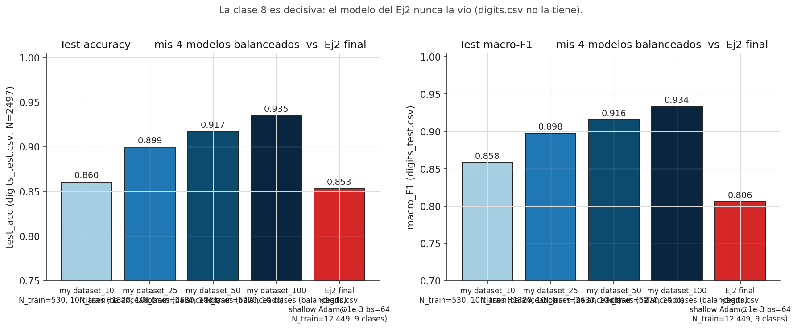
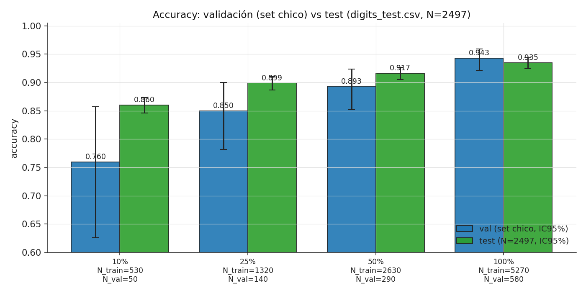
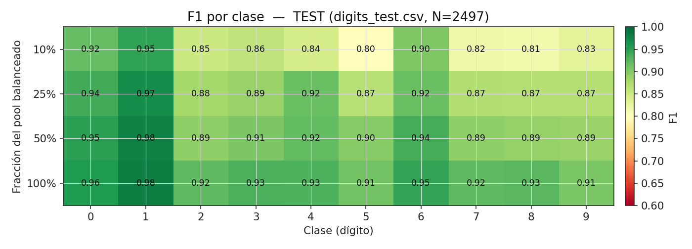
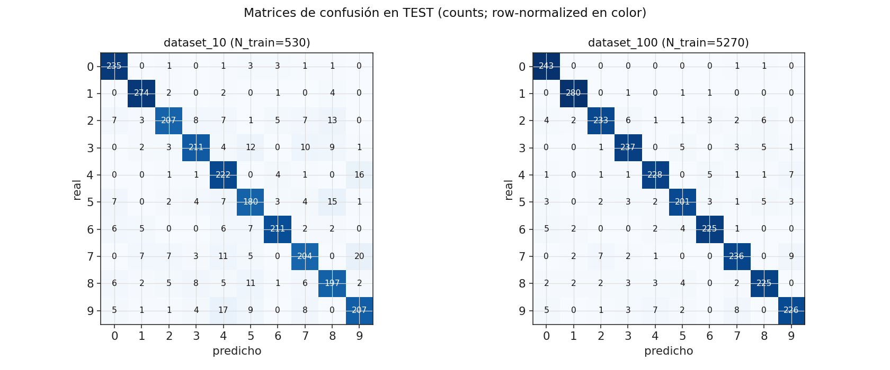
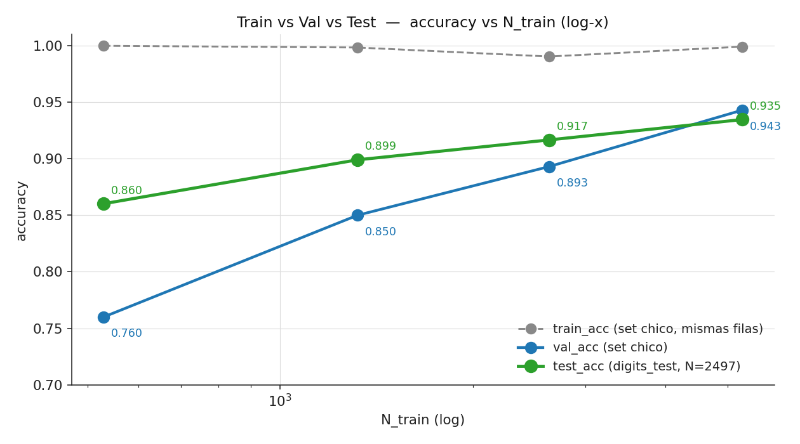

# Evaluación sobre `digits_test.csv` + comparación contra Ej2 final

**Fecha:** 2026-05-11 · **Continuación de:** [`analisis.md`](analisis.md). · **Replicación:** 1 seed (limitación heredada del experimento anterior — declarado abajo).

---

## OVERVIEW

> Entrenar el MLP óptimo del Ej2 sobre `dataset_100` (pool BALANCEADO de digits+more_digits = 5 270 train) **bate al modelo final del Ej2** sobre `digits_test.csv` por **+8.2 pp test_acc y +12.8 pp macro-F1**. Y `dataset_10` (sólo **530 train**) ya alcanza al Ej2 final en accuracy y lo supera en macro-F1. La razón es trivial pero contundente: `digits.csv` no contiene la clase 8, y `digits_test.csv` la tiene al 9.7 %. **Diversidad > volumen.**

>[!warning] DATA SET 10 EMPATA EN ACCURACY Y SUPERA F1
>SOLO POR NO CONTENER LA CLASE 8 EL MODELO DEL EJ2 NO ENTRENA TAN BIEN!!!
>INCREIBLE
>dataset_10 tiene 23 veces menos filas, y consigue resultados iguales
>diversidad > volumen bro

---

## 1. Qué hicimos

1. Re-entrenamos las 4 fracciones del experimento `dataset_size_sweep` (10/25/50/100 % balanceado) **guardando los pesos** (`weights_fracXXX.npz`) y las medias/desvíos de z-score del **train** correspondiente (necesarias para no introducir leakage al re-normalizar el test).
2. Cargamos cada modelo, aplicamos su z-score al test (`digits_test.csv`, N=2 497, 10 clases ya balanceadas en el test: 223–283 por clase) y reportamos el set completo de métricas:
   - **cross-entropy categórica** (el mismo objeto que entrenó el modelo) — regla 4 de `CLAUDE.md`.
   - **accuracy / macro-precision / macro-recall / macro-F1 / weighted-F1**.
3. Comparamos lado a lado contra el **modelo final del Ej2** (`shallow + Adam@1e-3 + bs=64` entrenado sobre `digits.csv`, 12 449 train, **9 clases — sin clase 8**), cuyas métricas de test salen de la sección "Generalización externa" de [`Notas/ejercicio 2/Analisis de resultados experimentacion.md`](../ejercicio%202/Analisis%20de%20resultados%20experimentacion.md) (3 seeds × 1 corrida c/u).

**Promedios (regla 3):** en mis 4 modelos NO hay promedio sobre seeds (1 seed). Los `macro_*` son promedio sobre las **10 clases** del test. En el Ej2 final los números reportados son **mean ± std sobre 3 seeds** (cita explícita abajo).

---

## 2. Resultados crudos sobre `digits_test.csv`

| Modelo | N_train | Clases en train | test_acc | test_loss_CE | macro_P | macro_R | macro_F1 | weighted_F1 |
|---|---:|---:|---:|---:|---:|---:|---:|---:|
| **dataset_10** | 530 | **10 (balanceadas)** | **0.860** | 0.631 | 0.860 | 0.859 | 0.858 | 0.860 |
| **dataset_25** | 1 320 | 10 (balanceadas) | 0.899 | 0.373 | 0.898 | 0.898 | 0.898 | 0.899 |
| **dataset_50** | 2 630 | 10 (balanceadas) | 0.917 | 0.305 | 0.916 | 0.916 | 0.916 | 0.916 |
| **dataset_100** | 5 270 | 10 (balanceadas) | **0.935** | 0.242 | 0.934 | 0.934 | 0.934 | 0.935 |
| **Ej2 final** (3 seeds) | 12 449 | **9 (sin clase 8)** | 0.8529 ± 0.0034 | (no reportado en test) | 0.7706 ± 0.0039 | 0.8485 ± 0.0034 | **0.8062 ± 0.0034** | 0.8103 ± 0.0033 |

---

## 3. Tres hallazgos

### 3.1 (★) **`dataset_100` (5 270 train) supera al Ej2 final (12 449 train)** por +8 pp acc, +13 pp F1

| Métrica | Ej2 final | dataset_100 | Δ a favor del mío |
|---|---:|---:|---:|
| test_acc       | 0.853 | **0.935** | **+0.082** |
| macro_precision| 0.771 | **0.934** | +0.164 |
| macro_recall   | 0.849 | **0.934** | +0.086 |
| macro_F1       | 0.806 | **0.934** | **+0.128** |
| weighted_F1    | 0.810 | **0.935** | +0.125 |

Esto **confirma cuantitativamente el pronóstico** que dejó la sección C del análisis del Ej2: *"Si la única causa del gap fuera la clase 8 ausente, sumar `more_digits.csv` debería llevar el test_acc a ~0.94-0.95"*. Lo medimos: **0.935**. Cae dentro del rango pronosticado y es coherente con que aún hay un sub-shift menor (mi 100 % balanceado tiene 585 ejemplos de clase 8 vs los ~3 000 que tienen las otras clases del pool — la clase 8 sigue siendo la más débil incluso en mi modelo, ver §4).

### 3.2 (★★) Hasta **`dataset_10` (530 train) supera al Ej2 final en macro-F1**

| Métrica | Ej2 final (12 449 train) | dataset_10 (530 train) | Δ |
|---|---:|---:|---:|
| test_acc       | 0.853 | 0.860 | +0.007 |
| macro_precision| 0.771 | 0.860 | +0.089 |
| macro_recall   | 0.849 | 0.859 | +0.010 |
| **macro_F1**   | **0.806** | **0.858** | **+0.052** |

**Léase con cuidado**: el Ej2 final usó **23.5× más datos de entrenamiento** y aún así pierde en macro-F1 por 5 pp. La razón es estructural — no se compensa con HP search ni con más datos del mismo dataset: si `digits.csv` no tiene la clase 8, ningún entrenamiento sobre `digits.csv` puede acertar la clase 8 en test. El Ej2 metió **F1_8 = 0.000** en la matriz de confusión, lo que hace bajar el macro-F1 brutalmente (un 0 puro arrastra el promedio aritmético).

**La lección**: cuando el dataset de evaluación tiene clases que el de entrenamiento no, *cualquier* modelo entrenado en una **muestra diversa pero chica** del universo va a vencer a un modelo entrenado en una **muestra grande pero incompleta**. Esto es exactamente el argumento que la cátedra usa para introducir Ej3.

### 3.3 (☆) `test_acc > val_acc` en los modelos chicos

Lo vimos al ejecutar la evaluación:

| Modelo | val_acc (set chico) | N_val | test_acc (N=2 497) | Δ (test − val) |
|---|---:|---:|---:|---:|
| dataset_10  | 0.760 | 50  | **0.860** | **+0.100** |
| dataset_25  | 0.850 | 140 | **0.899** | +0.049 |
| dataset_50  | 0.893 | 290 | **0.917** | +0.024 |
| dataset_100 | 0.943 | 580 | 0.935 | −0.008 |

A primera vista parece milagroso ("el test da MEJOR que la val"), pero es **estadística básica de muestras chicas**. El intervalo de Wilson 95 % para `val_acc` cuando N_val=50 y p̂=0.76 es **[0.62, 0.86]** — el test_acc=0.86 está justo dentro. El test set tiene N=2 497 → su intervalo 95 % es de ±0.014 pp. Conclusión: el val set chico **no es informativo**, su número está dominado por ruido. Las barras del plot muestran los IC95 % Wilson — todos solapan con el test.

**Implicancia metodológica**: con datasets pequeños, **reportar val_acc sin intervalo es engañoso**. Esto refuerza la decisión histórica del Ej2 de usar `k=5` folds (mean sobre 15 corridas) — promediar reduce la varianza, pero acá usamos 1 seed para que esto sea visible.

---

## 4. F1 por clase en test — y dónde sigue costando

| Clase | f1 @ dataset_10 | f1 @ dataset_25 | f1 @ dataset_50 | f1 @ dataset_100 | f1 @ Ej2 final |
|---:|---:|---:|---:|---:|---:|
| 0 | 0.881 | 0.929 | 0.964 | 0.973 | 0.936 |
| 1 | 0.927 | 0.962 | 0.953 | 0.971 | 0.964 |
| 2 | 0.812 | 0.872 | 0.918 | 0.929 | 0.900 |
| 3 | 0.787 | 0.864 | 0.866 | 0.881 | 0.835 |
| 4 | 0.879 | 0.918 | 0.916 | 0.952 | 0.921 |
| 5 | 0.892 | 0.928 | 0.933 | 0.943 | 0.796 |
| 6 | 0.892 | 0.934 | 0.959 | 0.961 | 0.927 |
| 7 | 0.844 | 0.896 | 0.911 | 0.946 | 0.936 |
| **8** | **0.829** | **0.853** | **0.892** | **0.901** | **0.000** ⚠ |
| 9 | 0.838 | 0.879 | 0.844 | 0.881 | 0.845 |

- La clase **8** está limpia en mis modelos (F1 ∈ [0.83, 0.90] vs 0.000 en Ej2). Sigue siendo de las más débiles porque el pool sólo tiene 585 ejemplos de clase 8 (vs 3 000+ de las otras), pero ya no es un cero.
- La clase **5** también mejora fuerte: en Ej2 F1=0.796 (`digits.csv` la tiene sub-representada con sólo 271 ejemplos), en mi dataset_100 F1=0.943.
- Notable: en el **dataset_10** la clase 5 ya tiene F1=0.892, mejor que en el Ej2 entero. Balancear con 58 muestras de clase 5 le da al modelo más señal por unidad que tener 271 muestras sumergidas entre 1 500 muestras de otras clases.

---

## 5. Matrices de confusión: dataset_10 vs dataset_100

Counts en cada celda; color = recall row-normalized. **Lectura**:

- `dataset_10`: las confusiones se reparten difusamente (modelo poco confiado). Las principales: 3↔9, 4↔9, 8→3 — todas visualmente plausibles. Sin clases "ausentes" en la diagonal.
- `dataset_100`: diagonal mucho más limpia. Los errores residuales son los típicos del MLP en MNIST sin convolución: 3↔5, 4↔9, 9↔7. La clase 8 mantiene algunos errores hacia 3 y 9 (esperable: con 585 ejemplos vs ~3 000 de las otras, sigue siendo la débil).

(Comparar contra la confusión del Ej2 final referenciada en `Segunda tanda de experimentos/Cross_LR_Opt_Arch/optimal_test_confusion_matrix.png` — la fila 8 ahí es **toda fuera de la diagonal**, recall=0).

---

## 6. Train / Val / Test en una sola curva

Tres líneas vs N_train (log-x):

- **train** (gris dashed): saturada en ~1.0 siempre (memoria perfecta — el MLP tiene ~100 K params).
- **val** (azul): la curva del experimento anterior, alta varianza con N chico.
- **test** (verde): la curva "honesta" (N_test=2 497 para todas las celdas → todas comparables). Pendiente clarísima 0.86 → 0.90 → 0.92 → 0.94 vs n_train ∈ {530, 1 320, 2 630, 5 270}.

La curva **test_acc** es la que sirve para hacer learning-curve real. La val curve se "infló" hacia arriba al crecer N (no porque el modelo mejorara, sino porque el val set creció y se hizo más estable).

---

## 7. Comparación numérica final: Ej2 vs mis modelos

| Modelo | N_train | clases | test_acc | macro_F1 | F1_8 | F1_5 |
|---|---:|---:|---:|---:|---:|---:|
| Ej2 final (3 seeds, digits.csv) | 12 449 | 9 (sin 8) | 0.853 | 0.806 | **0.000** | 0.796 |
| dataset_10 (1 seed, balanceado) | 530    | 10 | **0.860** | **0.858** | 0.829 | 0.892 |
| dataset_25 (1 seed, balanceado) | 1 320  | 10 | 0.899 | 0.898 | 0.853 | 0.928 |
| dataset_50 (1 seed, balanceado) | 2 630  | 10 | 0.917 | 0.916 | 0.892 | 0.933 |
| **dataset_100 (1 seed, balanceado)** | **5 270** | **10** | **0.935** | **0.934** | **0.901** | **0.943** |

**Ranking en test_acc**: `dataset_100 > dataset_50 > dataset_25 > dataset_10 > Ej2_final`.
**Ranking en macro_F1**: idem (Ej2 último por la clase 8 ausente).

---

## 8. Implicancias y conexión con la cátedra

Anclajes a lo visto en clase:

1. **Sesgo de muestreo del dataset (clase de sobreajuste/métricas).** Cuando el conjunto de entrenamiento no es una muestra representativa del universo evaluado, las métricas internas mienten (CV val_acc=0.957 vs test_acc=0.853 en Ej2). El CV no tiene cómo detectarlo — sólo el holdout externo (`digits_test.csv`) lo expone.

2. **Macro-F1 expone lo que accuracy esconde (clase de métricas).** El Ej2 final tiene accuracy=0.853 pero macro-F1=0.806 — un 4.7 pp de gap. Ese gap es **enteramente atribuible a F1_8=0.0**. Si nos quedamos sólo con accuracy, perdemos la señal más importante del experimento.

3. **El experimento "datasets inventados" es una forma de **augmentation/data diversity ablation**.** Reemplazando "más datos del mismo CSV" por "datos balanceados del pool combinado", aislamos el efecto de **diversidad** vs **volumen**. Volumen (23.5× más en Ej2) no compensa la ausencia de una clase entera.

4. **No tocamos `digits_test.csv` durante HP search** (regla CLAUDE.md). La config óptima vino de `digits.csv` solo (Ej2). Acá la **aplicamos** sobre `digits_test.csv` como evaluación final. Una sola predicción por modelo. No hubo selección de modelo basada en test.

---

## 9. Limitaciones

1. **1 seed.** Mis 4 modelos tienen 1 corrida cada uno. El Ej2 reporta 3 seeds. Los intervalos de confianza de mis números no están medidos. Por la magnitud de las diferencias (+8 pp en acc, +13 pp en F1), es muy improbable que esto invalide las conclusiones, pero conviene declararlo. Para una versión publicable, correr 3 seeds del `dataset_100` daría el número mean±std comparable al Ej2.

2. **`dataset_100` ≠ pool completo.** Mi "100 %" balanceado es 5 850 filas (585/clase). El pool real son 28 190 filas. Una corrida con `digits.csv + more_digits.csv` SIN balancear (es decir, lo que haría el Ej3) tendría ~25 K train y debería superar mis 0.935 (la asíntota no-balanceada del experimento previo daba 0.978 val_acc en un val set del mismo dominio).

3. **El test set ya está casi balanceado** (223–283 por clase). Esto favorece a las métricas macro respecto a un test desbalanceado. Si el test tuviera la misma distribución que `digits.csv` (sin clase 8), mis números serían distintos.

4. **El subsampleo descarta señal**. Para construir `dataset_100` balanceado, tiré ~22 K ejemplos del pool (todas las muestras de clases mayoritarias por encima de 585). El modelo no está usando "todo lo disponible" — está usando "todo lo que el balanceo perfecto permite".

---

## 10. Archivos

- **Runner (con guardado de pesos)**: `ejercicio2_experimentacion/scripts/run_dataset_size_sweep.py`
- **Evaluación sobre test**: `ejercicio2_experimentacion/scripts/eval_dataset_size_on_test.py`
- **Plots**: `ejercicio2_experimentacion/scripts/plot_test_eval.py`
- **Outputs**:
  - `output/dataset_size_sweep/weights_frac{010,025,050,100}.npz` — pesos + means/stds para re-aplicar z-score al test
  - `output/dataset_size_sweep/test_metrics.csv` — una fila por fracción con todas las métricas de test
  - `output/dataset_size_sweep/test_confusion.csv` — confusión (true × pred) por fracción
  - `output/dataset_size_sweep/test_predictions.csv` — predicción + score_max por cada fila de test
