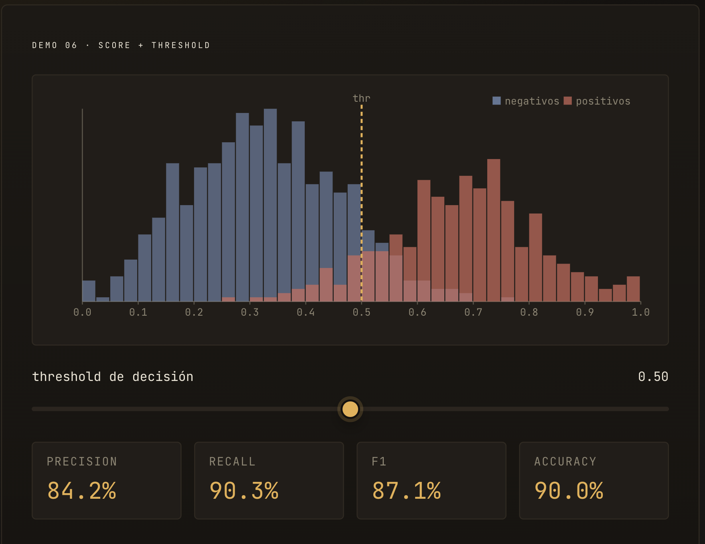

# Analisis preliminar de los datos

## timestamp vs target

Pareciera que no influye timestamp. Podemos probar de entrenar el modelo excluyendo esta columna.

ademas vemos que la correlacion R da 0!

## amount_usd vs target

Si una compra tiene amount > 500 es muy probable que sea fraudulento.

Vemos que la mayoría de los datos fraudulentos estan abajo de 750 amount_usd.

Query: Cantidad de datos fraudulentos total. Cantidad de datos fraudulentos por debajo de 500. Cantidad de datos fraudulentos por debajo de 750. Cantidad de datos fraudulentos por encima de 500. Cantidad de datos fraudulentos por encima de 750. Porcentaje de datos fraudulentos por debajo de 500. Porcentaje de datos fraudulentos por debajo de 750.

grafico de distribucion de fraudulentos y no fraudulentos eje x amount_usd eje y cantidad y barras coloreadas para ver la distribucion. Para este grafico filtra filas que tengan amount <750.

## quantity_purchased vs target

De 10 quantity en adelante **solo hay compras fraudulentas.**

Cantidad y Porcentaje de filas con mas de 10 quantity_purchased.

Porcentaje de compras fraudulentas entre 3 y 9.
Tomando las compras totales entre 3 y 9: porcentaje fraudulentas y no fraudulentas.

Grafico de distribucion de fraudulentos y no fraudulentos eje x quantity , eje y cantidad , barras coloreadas para ver distribucion, unicamente datos con quantity < 10.

## session_duration_seconds vs target

No hay compras fraudulentas con session_duration_seconds > 500.

La mayoría de las compras con session_duration_seconds < 50 son fraudulentas. De todas las compras fraudulentas, porcentaje de fraudulentas con session < 50. De todas las compras con session < 50, porcentaje q son fraudulentas.

Parece q la mayoría de las compras fraudulentas estan en session < 150. De todas las compras con session < 150, porcentaje que son fraudulentas. De todas las compras fraudulentas, porcentaje que esta < 150, y porcentaje con 50 < session < 150.

De todas las compras entre 200 y 500, porcentaje que son fraudulentas.
De todas las compras fraudulentas con session < 150, distribucion del valor de probabilidad de fraude.

## days_since_last_purchase vs target

Dificil sacar conclusiones: si una compra tiene days_since_last_purchase > 20, muy probablemente no sea fraudulenta. Query: tirame alguna query interesante para probar o desvalidar esta hipotesis o algo distinto interesante que me haya pasado por alto.

## account_age_days vs target

Parece que la mayoria de las compras fraudulentas estan < 250. Además entre las compras no fraudulnetas, hay muy poca distribución con <250. La mayoria de las compras no fraudulentas parecieran estar por encima de 1500.

Porcentaje entre las compras fraudulentas con account_age < 250. Porcentaje de compras no fraudulentas < 250. Porcentaje de compras no fraudulentas > 1500, porcentaje de compras no fraudulentas > 2000.

grafico de distribucion fraudulentas y no fraudulentas eje X account age days, eje Y cantidad de datos, barras coloreadas para ver distribucion.

## device_screen_resolution

Pareciera que no te dice nada. Podriamos saltear esta columna en el dataset. Vemos que el coeficiente de correlacion da 0!!

Query: un grafico que muestre la distribucion de fraudulentas y no fraudulentas con eje X time_since_last_login y eje y cantidad.

## items_viewed_before_purchase vs target

Si la compra tiene items_viewed >= 15, altisimamente probable que sea fraudulenta.

Pareciera que la debajo de 15, la mayoria de las compras fraudulentas estan distribuidas entre 8 y 14. Query: grafico de distribucion fraudulentas y no fraudulentas con items_viewed < 15 (asi distribucion eje y cantidad eje x items_viewed.)
