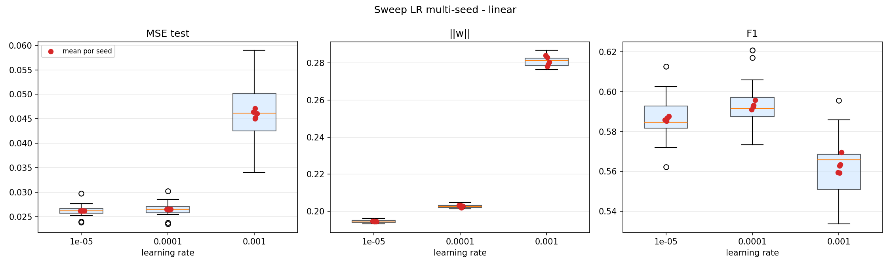

# Sweep LR multi-seed — perceptrón linear

Experimento: 5 seeds × 3 LRs × 5 folds = 75 entrenamientos. `epochs=500` (suficiente para convergencia segun single-seed). Seeds: [np.int64(7), np.int64(13), np.int64(21), np.int64(42), np.int64(99)].

## Resumen agregado por LR

**Total (todos los seeds × folds):**

| lr | MSE test (mean ± std) | ‖w‖ (mean ± std) | F1 (mean ± std) |
|---|---|---|---|
| 0.0001 | 0.02651 ± 0.00139 | 0.2027 ± 0.0010 | 0.5930 ± 0.0104 |
| 0.001 | 0.04599 ± 0.00616 | 0.2810 ± 0.0027 | 0.5629 ± 0.0133 |
| 1e-05 | 0.02622 ± 0.00119 | 0.1945 ± 0.0008 | 0.5862 ± 0.0105 |

**Dispersion entre seeds** (cada celda usa el promedio sobre folds de cada seed):

| lr | MSE test seed-std | ‖w‖ seed-std | F1 seed-std |
|---|---|---|---|
| 0.0001 | 0.00006 | 0.0006 | 0.0017 |
| 0.001 | 0.00085 | 0.0025 | 0.0042 |
| 1e-05 | 0.00002 | 0.0001 | 0.0010 |

## Per-seed (mean sobre folds)

| lr | seed | MSE test | ‖w‖ | F1 |
|---|---|---|---|---|
| 0.0001 | 7 | 0.02647 | 0.2021 | 0.5923 |
| 0.0001 | 13 | 0.02654 | 0.2029 | 0.5958 |
| 0.0001 | 21 | 0.02644 | 0.2021 | 0.5932 |
| 0.0001 | 42 | 0.02658 | 0.2032 | 0.5927 |
| 0.0001 | 99 | 0.02651 | 0.2033 | 0.5911 |
| 0.001 | 7 | 0.04502 | 0.2782 | 0.5628 |
| 0.001 | 13 | 0.04608 | 0.2805 | 0.5697 |
| 0.001 | 21 | 0.04528 | 0.2793 | 0.5635 |
| 0.001 | 42 | 0.04713 | 0.2831 | 0.5592 |
| 0.001 | 99 | 0.04642 | 0.2841 | 0.5594 |
| 1e-05 | 7 | 0.02621 | 0.1945 | 0.5853 |
| 1e-05 | 13 | 0.02622 | 0.1946 | 0.5877 |
| 1e-05 | 21 | 0.02619 | 0.1945 | 0.5868 |
| 1e-05 | 42 | 0.02625 | 0.1946 | 0.5855 |
| 1e-05 | 99 | 0.02621 | 0.1946 | 0.5858 |

## Datos crudos

- `raw.csv` — una fila por (lr, seed, fold) con todas las metricas + ‖w‖.
- `per_seed.csv` — agregado por (lr, seed).
- `summary.csv` — agregado por lr.