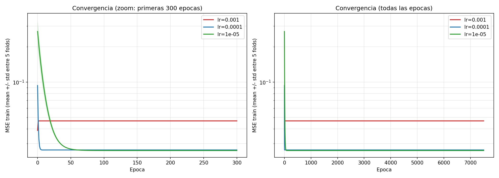

# Sweep LR — perceptrón lineal (revisado con std, pesos y métricas)

Re-análisis del sweep `lr ∈ {0.001, 0.0001, 1e-5}` (5 folds estratificados, `epochs=7500`, `epsilon=1e-4`, z-score fit-on-train) agregando std entre folds, normas de pesos y métricas de clasificación con threshold=0.5.

## Convergencia (mean ± std entre folds)

Nota: el lineal solo loggea `mse_train` (no test por época). Para test ver tabla.

## Tabla resumen (mean ± std, 5 folds)

| lr      | MSE train          | MSE test           | ‖w‖ (sin bias)   | bias              | accuracy        | precision       | recall          | F1              |
|---------|--------------------|--------------------|------------------|-------------------|-----------------|-----------------|-----------------|-----------------|
| 0.001   | 0.04674 ± 0.00034  | 0.04713 ± 0.00823  | 0.2831 ± 0.0007  | 0.4531 ± 0.0010   | 0.8172 ± 0.0088 | 0.3882 ± 0.0115 | 1.0000 ± 0.0000 | 0.5592 ± 0.0120 |
| 0.0001  | 0.02642 ± 0.00008  | 0.02658 ± 0.00085  | 0.2032 ± 0.0011  | 0.4239 ± 0.0013   | 0.8427 ± 0.0077 | 0.4235 ± 0.0130 | 0.9873 ± 0.0075 | 0.5927 ± 0.0139 |
| 1e-05   | 0.02611 ± 0.00008  | 0.02625 ± 0.00038  | 0.1946 ± 0.0010  | 0.4228 ± 0.0014   | 0.8385 ± 0.0062 | 0.4168 ± 0.0100 | 0.9839 ± 0.0026 | 0.5855 ± 0.0102 |

## Pesos finales por feature (mean ± std)

| feature                    | lr=0.001         | lr=0.0001        | lr=1e-5          |
|----------------------------|------------------|------------------|------------------|
| amount_usd                 | 0.1983 ± 0.0010  | 0.0976 ± 0.0020  | 0.0867 ± 0.0019  |
| quantity_purchased         | 0.1266 ± 0.0006  | 0.0860 ± 0.0009  | 0.0796 ± 0.0010  |
| session_duration_seconds   | -0.0757 ± 0.0015 | -0.0727 ± 0.0011 | -0.0715 ± 0.0010 |
| days_since_last_purchase   | -0.0778 ± 0.0006 | -0.0787 ± 0.0013 | -0.0785 ± 0.0014 |
| account_age_days           | -0.1116 ± 0.0007 | -0.1107 ± 0.0010 | -0.1099 ± 0.0011 |
| items_viewed_before_purchase | -0.0234 ± 0.0004 | -0.0245 ± 0.0006 | -0.0257 ± 0.0006 |

## Hallazgos

1. **`lr=0.001` se queda lejos del óptimo.** MSE test ~0.047 vs ~0.026 de los otros dos (~78% peor).
2. **Std MSE test inflado en `lr=0.001`** (0.00823) vs `0.0001` (0.00085) y `1e-5` (0.00038): ~10–22× más dispersión entre folds → mayor sensibilidad a la partición.
3. **Pesos inflados en `lr=0.001`.** ‖w‖=0.28 vs 0.20/0.19 en los otros. `amount_usd` y `quantity_purchased` se inflan (0.198/0.127 vs 0.098/0.086 en `lr=0.0001`). Las features con peso pequeño quedan casi iguales en los 3 — el overshoot impacta principalmente las direcciones de mayor gradiente.
4. **F1 / accuracy peores con `lr=0.001`** (0.559 vs 0.593 / 0.817 vs 0.843).
5. **`lr=0.0001` vs `lr=1e-5`**: MSE casi igual (0.02658 vs 0.02625), pesos casi iguales, F1 ligeramente mejor en `0.0001` (0.593 vs 0.586). `1e-5` tarda ~170 épocas en llegar al régimen vs ~10 de `0.0001`.

## Decisión

**`lr=0.0001`** — domina o empata en todas las métricas, es ~17× más rápido que `1e-5` para igual MSE/F1. `lr=0.001` queda descartado por overshoot evidente (MSE final, std entre folds, pesos inflados, F1 peor).
