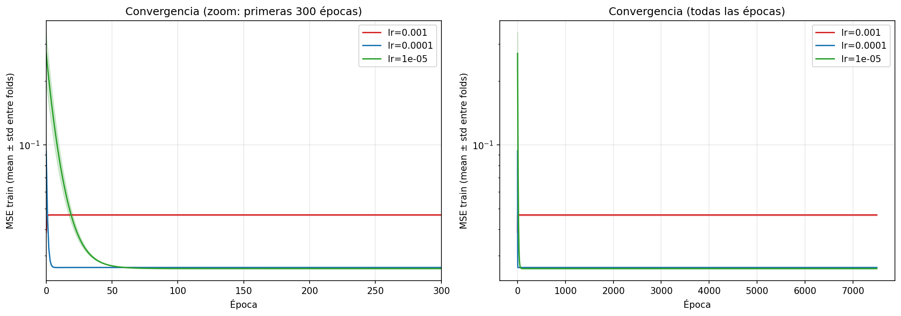

# Análisis del sweep de learning rates — perceptrón lineal

Sweep de 3 modelos con `lr ∈ {0.001, 0.0001, 1e-5}`, todos con `epochs=7500`, `epsilon=1e-4`, `k_folds=5` estratificado, mismas 6 features informativas (z-score, fit-on-train-only). Configs en `configs/lr_001.json`, `lr_0001.json`, `lr_00001.json`.

## TL;DR

`lr=0.0001` es el sweet spot. `lr=0.001` overshoots y se estabiliza en un punto peor. `lr=1e-5` converge un poco más lento y al mismo MSE pero con F1 ligeramente peor. **Ningún modelo se acerca al baseline determinístico** (`simple_prediction.py`, F1 ≈ 0.89): el modelo lineal con threshold 0.5 satura el predictor y no logra precision aceptable.

## Resultados (mean ± std sobre 5 folds)

| Config | MSE test | Accuracy | Precision | Recall | F1 | Convergencia |
|---|---:|---:|---:|---:|---:|---|
| `lr=0.001` | 0.0471 ± 0.0074 | 0.817 ± 0.008 | 0.388 ± 0.010 | **1.000** ± 0.000 | 0.559 ± 0.011 | epoch 0 (oscila después) |
| `lr=0.0001` | **0.0266** ± 0.0008 | **0.843** ± 0.007 | **0.424** ± 0.012 | 0.987 ± 0.007 | **0.593** ± 0.012 | epoch ~10 |
| `lr=1e-5` | 0.0262 ± 0.0003 | 0.839 ± 0.006 | 0.417 ± 0.009 | 0.984 ± 0.002 | 0.586 ± 0.009 | epoch ~170 |

Para comparar, el **baseline determinístico** (`simple_prediction.py`, 3 reglas duras OR) sobre el dataset entero: precision=1.000, recall=0.800, F1=0.889. El perceptrón lineal con identidad **no compite** contra eso.

## Convergencia (MSE vs época)

**Lecturas crudas del MSE de train:**

| LR | epoch 0 | epoch 100 | epoch 1000 | epoch 7499 | epoch del min global |
|---|---:|---:|---:|---:|---|
| 0.001 | 0.040 | 0.046 | 0.046 | 0.046 | epoch 0 (¡el min lo vio antes de oscilar!) |
| 0.0001 | 0.090 | 0.0264 | 0.0264 | 0.0264 | epoch ~10 |
| 1e-5 | 0.250 | 0.0261 | 0.0261 | 0.0261 | epoch ~170 |

### Lectura por LR

**`lr=0.001` — overshoot.** El MSE cae al mínimo en la primera época (online learning hace 6000 updates en una pasada → eso ya es muchísimo movimiento) y después **sube** y se estabiliza ~15% por encima del mínimo que vio. Esto es el síntoma clásico de learning rate demasiado alto: cada update sobreescribe el progreso anterior y el modelo orbita alrededor del óptimo sin entrar nunca. El recall=1.0 es engañoso aquí — significa que el modelo predice positivo a todo lo que se mueve, no que aprenda.

**`lr=0.0001` — convergencia rápida y limpia.** Llega al mínimo en epoch ~10 y se queda planito hasta el final. Las 7490 épocas restantes son tiempo perdido. El MSE final (~0.0264) y las métricas de clasificación son las mejores del sweep: F1=0.593, precision=0.424, recall=0.987.

**`lr=1e-5` — convergencia lenta pero correcta.** Tarda ~170 épocas en llegar al mismo régimen y termina con MSE marginalmente mejor (0.0262 vs 0.0266) pero F1 levemente peor (0.586 vs 0.593). La diferencia en F1 viene de que con `lr` más chico los pesos se mueven menos del punto inicial random → el bias termina en un punto que cruza el threshold con un patrón apenas distinto.

### Implicancia operativa

Para todos los LR razonables, **convergencia ocurre antes de epoch 200**. El cap de 7500 épocas fue overkill. Con `epsilon=1e-4`, ninguno cortó porque el MSE final está en 0.026, dos órdenes de magnitud arriba del threshold. Para sweeps futuros, **`epochs=500` y `epsilon=1e-5`** es razonable.

## Pesos aprendidos (escala normalizada z-score)

Promedio entre folds, ordenados por magnitud:

| Feature | lr=0.001 | lr=0.0001 | lr=1e-5 |
|---|---:|---:|---:|
| `bias` (w0) | +0.453 | +0.423 | +0.423 |
| `amount_usd` | +0.198 | +0.098 | +0.087 |
| `quantity_purchased` | +0.127 | +0.086 | +0.080 |
| `account_age_days` | -0.112 | -0.111 | -0.110 |
| `days_since_last_purchase` | -0.078 | -0.079 | -0.079 |
| `session_duration_seconds` | -0.076 | -0.072 | -0.071 |
| `items_viewed_before_purchase` | -0.023 | -0.024 | -0.025 |

**Observaciones:**

1. **Estabilidad entre folds excelente:** la `std` entre folds es < 1% del valor para todas las features (ver `weights.csv` por modelo). El K-fold estratificado está haciendo su trabajo.

2. **Signos consistentes con el análisis exploratorio**, salvo `items_viewed_before_purchase`:
   - Positivos esperados: `amount_usd`, `quantity_purchased`, `items_viewed_before_purchase` (más alto = más fraude).
   - Negativos esperados: `account_age_days`, `session_duration_seconds`, `days_since_last_purchase` (más alto = menos fraude).
   - **Anomalía:** `items_viewed` salió ligeramente negativo. Probablemente el modelo lineal lo está usando como contrapeso de las otras dos features positivas (`amount_usd` y `quantity_purchased` ya cargan toda la señal de "comportamiento sospechoso de cantidad", e `items_viewed` queda redundante o anti-correlacionado en la frontera).

3. **Bias = +0.42:** el output base del modelo (sin features) ya está cerca del threshold 0.5. Cualquier feature con peso positivo cruza fácil → eso explica el recall altísimo y la precision baja. Si bajáramos el threshold, recall se va a 1.0; si lo subimos, recall cae rápido.

4. **`lr=0.001` infla los pesos.** `amount_usd` queda en 0.20 vs 0.09 con `lr=0.0001`. El overshoot empuja los pesos lejos del óptimo del MSE, y el modelo "compensa" estirando los coeficientes. Esto es lo que sube el MSE de 0.027 a 0.047.

## Por qué F1 es bajo (limitación geométrica)

Tres barreras combinadas:

1. **Activación identidad sin acotar.** El output `O = w·x` no está en [0,1] aunque el target sí. Los `O` para los positivos del BigModel terminan dispersos arriba de 0.5 (well — algunos), pero **muchos no-positivos también caen arriba de 0.5** porque el bias ya está ahí. No hay sigmoide que comprima los extremos.

2. **Frontera lineal vs umbrales duros.** El análisis exploratorio mostró que 3 features (`amount_usd`, `quantity_purchased`, `items_viewed_before_purchase`) tienen umbrales **discontinuos** que separan perfecto. Un perceptrón lineal **no puede modelar discontinuidades** — tiene que tirar el plano "empinado" para acercarse al salto, sacrificando el rango bajo. Eso explica la pésima precision: el plano cruza 0.5 mucho antes de los umbrales reales.

3. **Threshold fijo en 0.5.** Con el output crudo no acotado, podría existir un threshold mejor (típicamente más alto, ~0.6-0.7) que mejore la precision al costo de recall. Eso lo veremos si después barremos thresholds para ROC.

## Comparación contra el baseline determinístico

El `simple_prediction.py` (3 reglas duras OR) tiene **precision=1.0, recall=0.80, F1=0.889** sobre el dataset entero. El mejor perceptrón lineal alcanza **F1=0.593**. Brecha de ~30 puntos.

Esto **confirma que el perceptrón lineal con identidad es estructuralmente insuficiente** para este dataset, no por falta de tuning sino por la geometría del problema. Lo esperable: el variant **no-lineal (sigmoid)** debería cerrar buena parte de esa brecha gracias a (a) output acotado a [0,1], (b) capacidad de modelar saturaciones y (c) gradientes mejor portados.

## Conclusiones y próximos pasos

1. **Recomendación de hiperparámetros para experimentos siguientes:** `lr=0.0001`, `epochs=500`, `epsilon=1e-5`. Es el setup que minimiza MSE y maximiza F1 con el tiempo de cómputo más razonable.

2. **Próximos experimentos prioritarios** (en orden):
   - **Variante no-lineal (sigmoide)** — esperamos que cierre buena parte de la brecha contra el baseline determinístico.
   - **Sweep de threshold** sobre el modelo `lr=0.0001` para construir una curva ROC y elegir el punto operativo (precision/recall) deseado.
   - **Ablation de features** — probar con/sin `items_viewed_before_purchase` (que salió con peso anómalo) para ver si simplifica.

3. **No vale la pena** seguir bajando el LR: `1e-5` ya converge al mismo régimen que `1e-4`. El piso del MSE está dictado por la limitación geométrica del modelo lineal, no por el optimizador.
