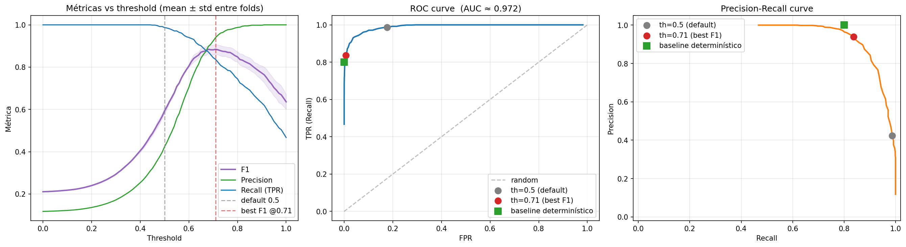

# Threshold sweep — perceptrón lineal `lr=0.0001`

Re-evaluación del modelo `lr_0001_20260428_190054` (sin reentrenar) variando el threshold de binarización en `[0, 1]` paso `0.01`. Se reproducen los mismos 5 folds estratificados (mismo seed) para fitear el normalizer en train, cargar los pesos guardados y aplicar los thresholds sobre `O = w·x` en cada test fold.

## Conceptos previos: threshold, precision, recall, F1

### ¿Qué es el threshold?

El perceptrón lineal con activación identidad produce un **número continuo** `O = w·x` (no acotado en [0,1]). Pero la pregunta real es **binaria**: ¿esta transacción es fraude (1) o no (0)?

Para convertir el continuo en binario aplicamos un **umbral (threshold)**:

```
predicción = 1  si O >= threshold  (clasifico como fraude)
predicción = 0  si O <  threshold  (clasifico como no-fraude)
```

El threshold es **un parámetro de evaluación, no de entrenamiento**: el modelo ya está entrenado, lo único que cambia es dónde "cortamos" la línea para decir fraude/no-fraude. **Por eso podemos barrer thresholds sin reentrenar.**

### ¿Qué son precision y recall?

Para cada threshold, contamos los 4 cuadrantes de la matriz de confusión:

|  | Realidad: fraude | Realidad: no-fraude |
|---|---|---|
| **Predicho: fraude** | TP (true positive) | FP (false positive) |
| **Predicho: no-fraude** | FN (false negative) | TN (true negative) |

A partir de esos conteos:

- **Precision** = `TP / (TP + FP)` → "de las que **dije** fraude, ¿qué fracción **era** fraude?" Mide la confianza en una alarma. Precision=0.94 quiere decir que cuando el modelo grita "fraude!", acierta el 94% de las veces.
- **Recall (TPR)** = `TP / (TP + FN)` → "de las que **eran** fraude, ¿qué fracción **detecté**?" Mide la cobertura. Recall=0.84 quiere decir que de todos los fraudes que ocurrieron, el modelo atrapó el 84%.
- **FPR** = `FP / (FP + TN)` → "de las **no-fraudes**, ¿qué fracción **marqué mal** como fraude?" Mide la tasa de falsa alarma.

### ¿Qué es F1?

F1 es la **media armónica** de precision y recall:

```
F1 = 2 · precision · recall / (precision + recall)
```

La media armónica **penaliza fuerte el valor más bajo**. Si precision=1.0 y recall=0.0 → F1=0 (porque no detectaste nada). Si ambos son 0.5 → F1=0.5. Para que F1 sea alto, **ambas** métricas tienen que serlo.

Es la forma estándar de reducir "precision y recall" a un único número cuando querés un modelo que ni grite mucho cuando no hay fraude (precision alta) ni se pierda fraudes (recall alto).

### ¿Por qué F1 cambia con el threshold?

Threshold y precision/recall están en **tensión directa**:

| Threshold bajo | Threshold alto |
|---|---|
| El modelo predice **positivo a casi todo** | El modelo predice positivo **sólo cuando está muy confiado** |
| Atrapa todos los fraudes (**recall ↑**) | Se pierde fraudes que no son obvios (**recall ↓**) |
| Pero también marca muchas no-fraudes (**precision ↓**) | Cuando dice "fraude", casi siempre acierta (**precision ↑**) |
| F1 bajo (porque precision pequeña) | F1 bajo (porque recall pequeño) |

Como F1 castiga al menor de los dos, **F1 se maximiza en el punto donde precision y recall están balanceados**. En este modelo eso pasa cerca de `th=0.71`. Más bajo, sobran FPs (precision tira F1 abajo); más alto, faltan TPs (recall tira F1 abajo).

### Aterrizado a este modelo

Mirando casos concretos del barrido:

| Threshold | Precision | Recall | F1 | Lectura |
|---:|---:|---:|---:|---|
| 0.30 | 0.17 | 1.00 | 0.29 | Predice fraude a casi todo. Captura el 100% pero el 83% de las "alarmas" son FPs. |
| 0.50 | 0.42 | 0.99 | 0.59 | Default. Todavía predice positivo demasiado seguido. |
| 0.71 | **0.94** | **0.84** | **0.89** | **Sweet spot**: cuando dice fraude acierta 94 de cada 100, y captura 84 de cada 100 fraudes reales. |
| 0.85 | 0.997 | 0.69 | 0.82 | Casi nunca se equivoca al gritar, pero se pierde 31% de los fraudes. |

El modelo es **el mismo** en los 4 casos — los pesos no cambian. Lo único que cambia es la frontera de decisión sobre el output continuo.

---

## TL;DR

**El modelo lineal con threshold óptimo prácticamente iguala al baseline determinístico.**

| Modelo | Precision | Recall | F1 | FPR |
|---|---:|---:|---:|---:|
| Lineal `th=0.5` (default) | 0.424 | 0.987 | 0.593 | 0.176 |
| **Lineal `th=0.71` (best F1)** | **0.940** | **0.837** | **0.885** | **0.007** |
| Baseline determinístico (3 reglas OR) | 1.000 | 0.800 | 0.889 | 0.000 |

**AUC ROC ≈ 0.972** — el modelo discrimina muy bien; lo único que estaba mal era el threshold por default. La conclusión del análisis anterior (`sweep_lr.md`) de que el lineal era "estructuralmente insuficiente" estaba equivocada en parte: la geometría del modelo es perfectamente capaz, era el threshold default `0.5` el que lo hacía ver mucho peor de lo que es.

## Curvas



(De izquierda a derecha: métricas vs threshold, ROC, Precision-Recall.)

## Operating points relevantes

| Threshold | F1 | Precision | Recall | FPR | Comentario |
|---:|---:|---:|---:|---:|---|
| 0.30 | 0.294 | 0.172 | 1.000 | 0.631 | predice positivo a casi todo |
| 0.50 | 0.593 | 0.424 | 0.987 | 0.176 | **default — pésima precision** |
| 0.60 | 0.805 | 0.705 | 0.940 | 0.052 | salto importante en F1 |
| 0.65 | 0.871 | 0.843 | 0.901 | 0.022 | balance razonable |
| 0.67 | 0.877 | 0.874 | 0.879 | — | **precision ≈ recall** |
| **0.71** | **0.885** | **0.940** | **0.837** | **0.007** | **F1 máximo** |
| 0.75 | 0.874 | 0.972 | 0.794 | 0.003 | baja un poco F1, sube precision |
| 0.82 | 0.833 | 0.994 | 0.718 | — | **precision ≥ 0.99**: matchea criterio del baseline determinístico |
| 0.85 | 0.816 | 0.997 | 0.692 | 0.000 | precision casi perfecta, recall medio |

## Análisis

### Por qué el threshold default 0.5 era engañosamente malo

El bias aprendido por el modelo (después de z-score) quedó en ~0.42 (mean entre folds). El target `big_model_fraud_probability` tiene mediana ~0.0 para no-fraude y ~0.95+ para fraude. Pero el output del perceptrón lineal con identidad **comprime el rango** porque tiene que ajustar simultáneamente:
- mantenerse cerca de 0 para los ~88% no-fraude
- alcanzar 1 para los ~12% fraude

El resultado es que la **distribución de los outputs del modelo está corrida hacia abajo**: la masa de los fraudes cae típicamente entre ~0.55 y ~0.95, mientras que los no-fraudes caen entre ~0.30 y ~0.55, con mucha superposición justo arriba de 0.5. Por eso un threshold en 0.5 captura todo el fraude pero también muchos FPs.

El threshold óptimo ~0.71 (cerca de la mediana entre 0.42 y 1.0) parte la distribución mucho mejor.

### Comparación con el baseline determinístico

El `simple_prediction.py` con sus 3 reglas duras OR tiene precision=1.0, recall=0.80, F1=0.889. El perceptrón lineal en su mejor punto:

- **Empata el F1** (0.885 vs 0.889) — diferencia <0.5%
- **Supera el recall** (0.837 vs 0.800) — captura ~32 fraudes que las reglas duras se pierden
- **Pierde algo de precision** (0.940 vs 1.000) — ~50 falsos positivos extra cada 5000 transacciones

Si lo que se quiere es **emparejar la precision perfecta del baseline**, con threshold ≥ 0.85 el lineal llega a precision=0.997 con recall=0.69. **No supera al baseline en ese régimen**: cuando se exige precision ~1.0, el baseline determinístico es más eficiente porque los fraudes que captura son los que tienen reglas perfectas; los ~32 fraudes "sutiles" que mejora el lineal vienen acompañados de FPs que erosionan precision.

### AUC ROC = 0.972

Interpretación: dada una transacción aleatoria de fraude y una aleatoria de no-fraude, el modelo asigna una probabilidad mayor a la de fraude **el 97.2% de las veces**. Es excelente capacidad de discriminación. El único problema es **dónde se elige cortar**, no la calidad de la señal.

Vale recordar que el baseline determinístico tampoco es comparable directamente en AUC porque sus 3 reglas son discretas; donde sí se compara es en el plano (precision, recall): el baseline cae justo afuera del frontier del lineal en `(0.80, 1.00)`, mientras que el lineal ofrece toda una curva continua de tradeoffs.

### Reconciliación con `sweep_lr.md`

El análisis anterior concluyó que "el perceptrón lineal con identidad es estructuralmente insuficiente" mirando F1=0.59 con threshold=0.5. **Esa conclusión era prematura**: la limitación que vimos era del *threshold mal elegido*, no del modelo. La parte que sigue siendo cierta es:

- El output del modelo no está acotado a [0,1] y **no replica fielmente** la salida continua del BigModel (MSE=0.027 es alto comparado con lo que daría un modelo no-lineal con sigmoide, y ese gap probablemente sigue existiendo).
- La **geometría** discreta del problema (umbrales duros en `amount`, `quantity`, `items_viewed`) **sigue limitando** la capacidad del lineal de reconstruir esos saltos exactos.

Pero como **clasificador binario** (con threshold ajustado), el lineal **es competitivo** con el baseline determinístico.

## Conclusiones y recomendación

1. **Para el reporte del TP**, comparar siempre el lineal en `th_F1_max ≈ 0.71`, no en `th=0.5`. El `th=0.5` es solo el "modo regresión", no el modo "detección de fraude".

2. **Pasamos al no-lineal con argumento sólido**: el lineal *clasifica* casi tan bien como el baseline duro, pero su *MSE de regresión* es alto y **no replica fielmente al BigModel** — eso es lo que el no-lineal con sigmoide debería mejorar. La pregunta interesante para el no-lineal pasa a ser: **¿logra MSE significativamente menor (mejor distillation) sin perder F1?**

3. **El threshold óptimo del lineal es punto operativo claro para el TP.** En `th=0.71` el modelo tiene F1=0.885 con precision=0.94 y recall=0.84 — un trade-off útil para producción si la pérdida por FP fuera comparable a la de FN.

4. **`sweep_lr.md` queda con un disclaimer**: la sección "Por qué F1 es bajo" subestima al modelo lineal porque medía con threshold fijo en 0.5. La limitación geométrica que mencionamos sigue válida pero **el F1=0.59 no era el "mejor F1 lineal posible"**; el mejor era 0.885.
