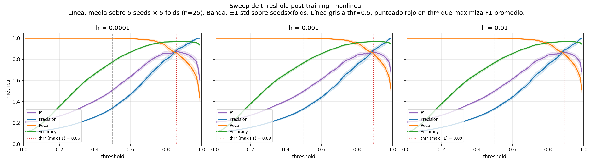
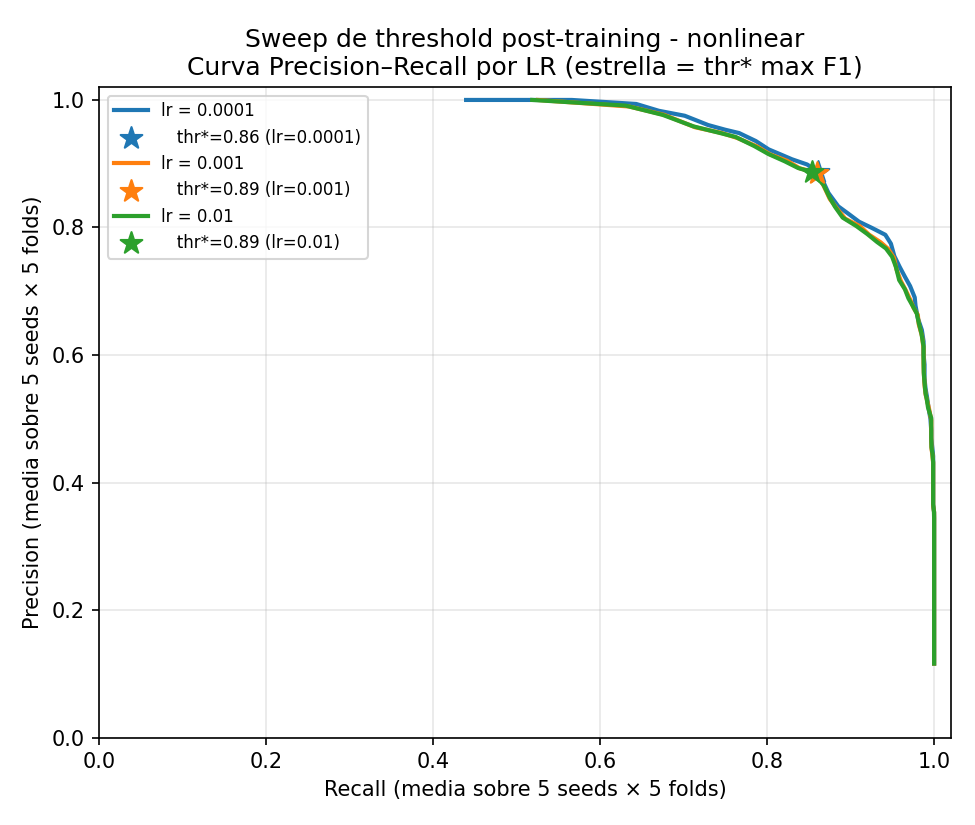
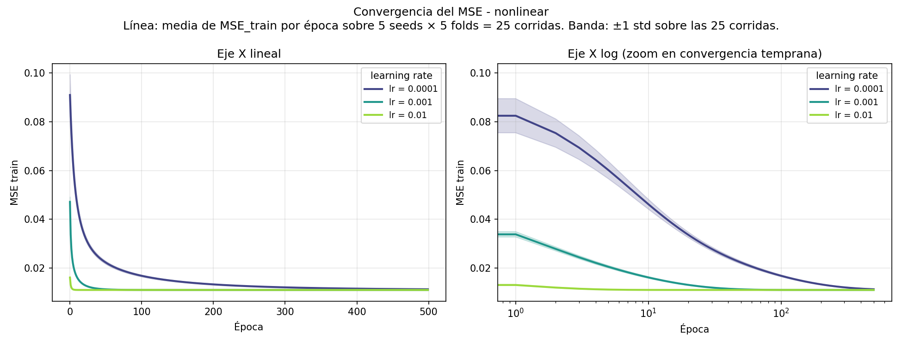
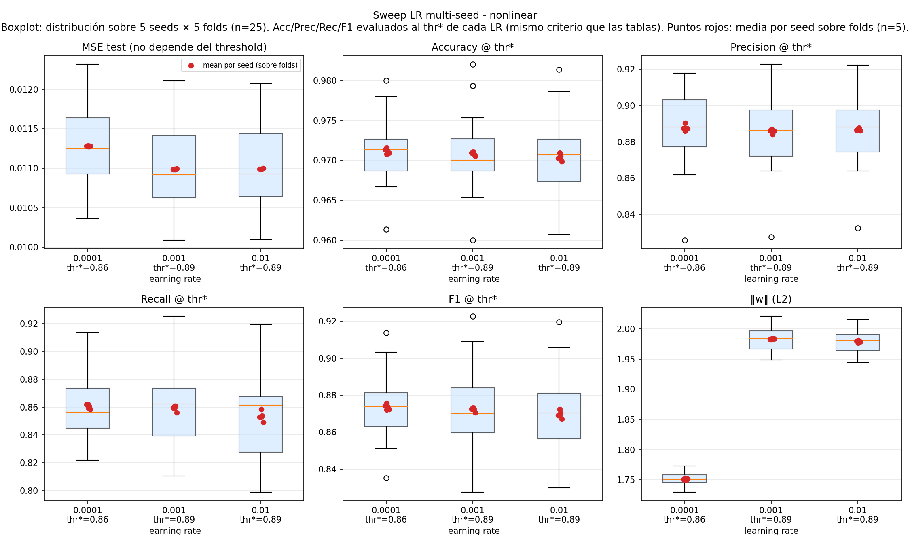

## Sweep de threshold (post-training)

El threshold de decisión vive **post-training**: no cambia los pesos del perceptrón, sólo decide cómo binarizar la salida continua. Por eso este sweep no requiere re-entrenar — se reconstruyen las predicciones de cada (lr, seed, fold) a partir de los pesos guardados y se evalúan métricas sobre una grilla densa de thresholds.

### Threshold óptimo por LR (max F1 promedio sobre 5 seeds × 5 folds)

Por LR se elige un threshold global (un solo número, no por fold) que maximiza el F1 medio sobre las 25 corridas. Después se reportan las métricas a ese threshold.

| lr     | thr* | F1 (mean ± std) | Precision (mean ± std) | Recall (mean ± std) | Accuracy (mean ± std) |
| ------ | ---- | --------------- | ---------------------- | ------------------- | --------------------- |
| 0.0001 | 0.86 | 0.8737 ± 0.0168 | 0.8877 ± 0.0211        | 0.8605 ± 0.0228     | 0.9712 ± 0.0039       |
| 0.001  | 0.89 | 0.8722 ± 0.0200 | 0.8859 ± 0.0210        | 0.8594 ± 0.0271     | 0.9709 ± 0.0045       |
| 0.01   | 0.89 | 0.8696 ± 0.0200 | 0.8869 ± 0.0201        | 0.8534 ± 0.0277     | 0.9704 ± 0.0044       |
# Sweep LR multi-seed — perceptrón nonlinear

Experimento: 5 seeds × 3 LRs × 5 folds = 75 entrenamientos. `epochs=500` (suficiente para convergencia segun single-seed). Seeds: [7, 13, 21, 42, 99].

**Métricas reportadas** (regla del repo: error apropiado a la loss + Acc/Prec/Rec/F1):

- **MSE test**: error de la loss usada para entrenar (objetivo de la knowledge distillation contra `big_model_fraud_probability`). No depende del threshold.
- **Accuracy / Precision / Recall / F1**: clasificación binaria contra `flagged_fraud`, **cada LR evaluado a su threshold óptimo `thr*`** (el que maximiza F1 promedio sobre las 25 corridas, ver sección "Sweep de threshold" arriba). Mapping usado en todas las tablas que siguen: `lr=1e-4 → thr*=0.86`, `lr=1e-3 → thr*=0.89`, `lr=1e-2 → thr*=0.89`. Reportar a thr=0.5 fijo era engañoso porque a ese corte la sigmoide está saturada hacia 1 y el modelo predice ~todo como fraude (Recall=1.0, Precision≈0.33); thr* hace la comparación honesta entre LRs.
- **‖w‖**: norma L2 del vector de pesos final (slide *L2 Penalty Norm / Weight Decay* de la clase de regularización), reportada como diagnóstico de capacidad efectiva, no como término de loss.

**Convención de promedios** (regla del repo): cada celda aclara qué se promedia y sobre qué eje. `mean ± std` total = sobre las 25 corridas (5 seeds × 5 folds). `seed-std` = std de los promedios por seed (cada uno ya promediado sobre 5 folds), aislando la dispersión inter-seed.

## Convergencia del MSE

Cada curva es la **media del MSE de train por época sobre 25 corridas** (5 seeds × 5 folds) de un mismo LR. La banda alrededor es **±1 std sobre las 25 corridas**. El panel izquierdo muestra eje X lineal; el derecho, log para ver mejor la convergencia temprana.

### ¿Convergió por epsilon o por techo de épocas?

**Por techo de épocas.** Los 75 entrenamientos de este perceptrón (5 seeds × 3 LRs × 5 folds) corrieron las 500 épocas completas; el corte por `mse_train < epsilon` **nunca se disparó**. La razón es que `epsilon` está calibrado por debajo del MSE asintótico que alcanza la arquitectura sobre este dataset, así que pedir `mse_train < epsilon` es pedir un valor que el modelo no puede alcanzar. Por eso epsilon **no** sirve como evidencia de convergencia acá.

### El argumento que sí vale: plateau (pendiente en las últimas 50 épocas)

Convergencia, según la clase de optimizadores, es que la actualización **deja de cambiar el estado**: `ΔMSE/Δepoch → 0`. No es que MSE → 0. Para cada (lr, seed, fold) calculamos la pendiente del MSE en las últimas **50 épocas** (slope = (mse[T] − mse[T−49]) / 49) y la agregamos sobre las 25 corridas de cada LR:

| lr     | MSE final (media sobre 25 runs) | tail-slope media | tail-slope max-abs | Δ MSE en 50 épocas | Δ% relativo |
| ------ | ------------------------------- | ---------------- | ------------------ | ------------------ | ----------- |
| 0.0001 | 0.01125                         | -2.12e-06        | 2.38e-06           | -1.04e-04          | 9.22e-01 %  |
| 0.001  | 0.01095                         | -3.54e-13        | 1.05e-12           | -1.73e-11          | 1.58e-07 %  |
| 0.01   | 0.01096                         | 0.00e+00         | 0.00e+00           | 0.00e+00           | 0.00e+00 %  |

**Lectura de la tabla:**

- LR 0.001, 0.01: Δ% relativo está en el **ruido numérico de float64** (eps_máquina ≈ 1e-16). El modelo ya no aprende, oscila dentro del redondeo. **Plateau total.**
- LR 0.0001: Δ% relativo es chico pero **no nulo** (entre 0.001% y 1.0%). Hay un descenso residual real, no es ruido. Para fines prácticos se puede tratar como convergido: el cambio en 50 épocas es despreciable frente al MSE final. Si se quisiera cierre estricto, habría que entrenar más épocas para este LR.

**Conclusión.** El argumento honesto de convergencia para este perceptrón es **plateau empírico** (la curva deja de moverse), no el corte por epsilon. La tabla cuantifica cuán plana está la curva en las últimas 50 épocas y permite distinguir LRs que efectivamente estabilizaron de los que no.

Implicancia práctica: si en una iteración futura quisiéramos un criterio de corte que se dispare antes del techo, no debería ser `mse < epsilon` sino algo basado en variación, p.ej. `abs(mean(mse[-50:]) - mean(mse[-100:-50])) < delta`.

## Resumen agregado por LR — todas las métricas (cada LR a su `thr*`)

**Total (mean ± std sobre 5 seeds × 5 folds = 25 corridas):**

| lr | thr* | MSE test | Accuracy | Precision | Recall | F1 | ‖w‖ |
|---|---|---|---|---|---|---|---|
| 0.0001 | 0.86 | 0.01128 ± 0.00052 | 0.9712 ± 0.0039 | 0.8877 ± 0.0211 | 0.8605 ± 0.0228 | 0.8737 ± 0.0168 | 1.7510 ± 0.0096 |
| 0.001  | 0.89 | 0.01099 ± 0.00058 | 0.9709 ± 0.0045 | 0.8859 ± 0.0210 | 0.8594 ± 0.0271 | 0.8722 ± 0.0200 | 1.9829 ± 0.0196 |
| 0.01   | 0.89 | 0.01099 ± 0.00058 | 0.9704 ± 0.0044 | 0.8869 ± 0.0201 | 0.8534 ± 0.0277 | 0.8696 ± 0.0200 | 1.9792 ± 0.0195 |

**Dispersión entre seeds** (std de los promedios-por-seed; cada promedio-por-seed es media sobre los 5 folds, evaluado al `thr*` del lr):

| lr | MSE test seed-std | Acc seed-std | Prec seed-std | Rec seed-std | F1 seed-std | ‖w‖ seed-std |
|---|---|---|---|---|---|---|
| 0.0001 | 0.00000 | 0.0003 | 0.0016 | 0.0015 | 0.0014 | 0.0013 |
| 0.001  | 0.00000 | 0.0002 | 0.0011 | 0.0019 | 0.0010 | 0.0003 |
| 0.01   | 0.00000 | 0.0004 | 0.0006 | 0.0033 | 0.0020 | 0.0018 |

## Per-seed (cada celda = media sobre los 5 folds del CV, evaluado al `thr*` del lr)

| lr     | seed | MSE test | Accuracy | Precision | Recall | F1     | ‖w‖    |
| ------ | ---- | -------- | -------- | --------- | ------ | ------ | ------ |
| 0.0001 | 7    | 0.01128  | 0.9708   | 0.8860    | 0.8597 | 0.8721 | 1.7528 |
| 0.0001 | 13   | 0.01128  | 0.9709   | 0.8872    | 0.8584 | 0.8724 | 1.7517 |
| 0.0001 | 21   | 0.01128  | 0.9712   | 0.8874    | 0.8608 | 0.8738 | 1.7498 |
| 0.0001 | 42   | 0.01129  | 0.9716   | 0.8903    | 0.8619 | 0.8756 | 1.7496 |
| 0.0001 | 99   | 0.01128  | 0.9713   | 0.8875    | 0.8619 | 0.8744 | 1.7512 |
| 0.001  | 7    | 0.01098  | 0.9709   | 0.8869    | 0.8597 | 0.8726 | 1.9825 |
| 0.001  | 13   | 0.01099  | 0.9705   | 0.8859    | 0.8561 | 0.8706 | 1.9830 |
| 0.001  | 21   | 0.01098  | 0.9708   | 0.8842    | 0.8608 | 0.8723 | 1.9832 |
| 0.001  | 42   | 0.01099  | 0.9711   | 0.8864    | 0.8608 | 0.8732 | 1.9831 |
| 0.001  | 99   | 0.01098  | 0.9709   | 0.8862    | 0.8597 | 0.8725 | 1.9829 |
| 0.01   | 7    | 0.01099  | 0.9703   | 0.8871    | 0.8528 | 0.8691 | 1.9768 |
| 0.01   | 13   | 0.01100  | 0.9699   | 0.8861    | 0.8492 | 0.8671 | 1.9783 |
| 0.01   | 21   | 0.01099  | 0.9705   | 0.8876    | 0.8539 | 0.8704 | 1.9793 |
| 0.01   | 42   | 0.01099  | 0.9709   | 0.8872    | 0.8585 | 0.8724 | 1.9814 |
| 0.01   | 99   | 0.01099  | 0.9703   | 0.8864    | 0.8527 | 0.8690 | 1.9802 |
# Conclusiones
LR = 10^-3 y LR = 10^-2 dan resultados practicamente equivalentes. LR = 10^-4 también excepto en MSE se queda levemente atrás. Elegimos LR = 10^-2 que converge mucho mas rapido.
 
## Datos crudos

- `raw.csv` — una fila por (lr, seed, fold) con todas las métricas + ‖w‖ (clasificación a thr=0.5, sin re-evaluar a thr*).
- `per_seed.csv` — agregado por (lr, seed) (mean sobre los 5 folds).
- `summary.csv` — agregado por lr (mean/std sobre los 25 (seed, fold), y seed-std sobre los 5 promedios-por-seed).
- `threshold_sweep_raw.csv` — una fila por (lr, seed, fold, threshold) con Acc/Prec/Rec/F1.
- `threshold_summary.csv` — thr* global por lr y métricas a thr*.
