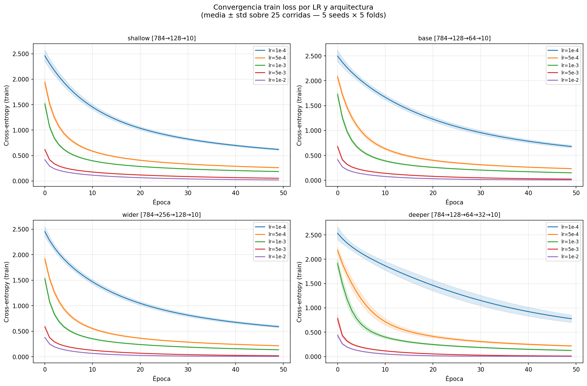
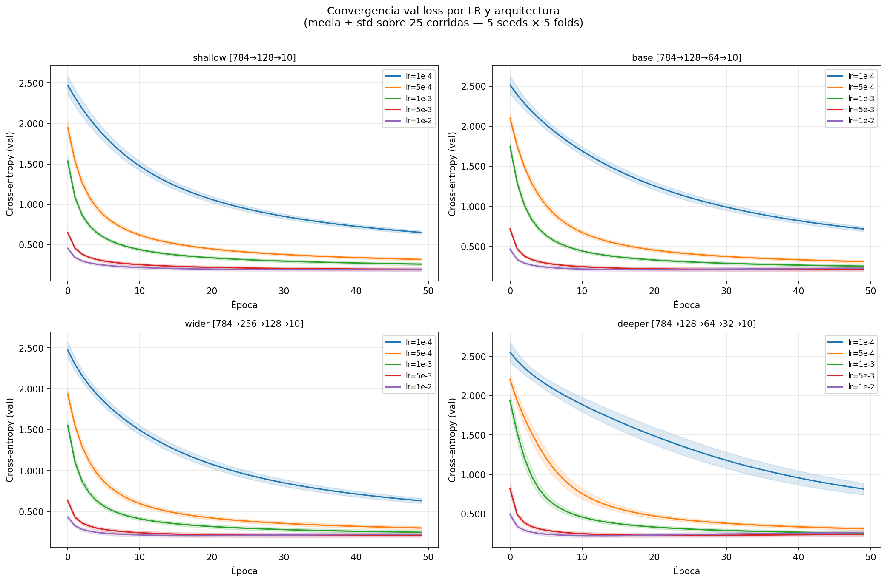

# Análisis del sweep de learning rates — Ejercicio 2

**Experimento:** 4 arquitecturas × 5 LR × 5 seeds × 5 folds = 500 corridas totales.
**Fijo en todas:** SGD básico (`w = w - lr · gradiente`), batch=32, 50 épocas, sin early stopping, z-score.
**Datos crudos:** `raw.csv` | **Curvas por época:** `epoch_history.csv` | **Resumen:** `summary.csv`

---

## LR explorados

| LR | Etiqueta |
|---|---|
| 0.0001 | 1e-4 |
| 0.0005 | 5e-4 |
| 0.001  | 1e-3 |
| 0.005  | 5e-3 |
| 0.01   | 1e-2 |

---

## Curvas de convergencia

### Train loss por época

### Val loss por época

---

## Resultados finales (época 50) — media ± std sobre 25 corridas (5 seeds × 5 folds)

| Arquitectura | LR | CE train | CE val | Accuracy val | F1 macro |
|---|---|---|---|---|---|
| shallow | 1e-4 | 0.6195 | 0.6524 | 0.840 ± 0.008 | 0.688 ± 0.010 |
| shallow | 5e-4 | 0.2618 | 0.3187 | 0.913 ± 0.005 | 0.797 ± 0.008 |
| shallow | 1e-3 | 0.1849 | 0.2606 | 0.929 ± 0.005 | 0.818 ± 0.007 |
| shallow | 5e-3 | 0.0529 | 0.1961 | 0.949 ± 0.005 | 0.842 ± 0.007 |
| shallow | 1e-2 | 0.0202 | 0.1926 | 0.952 ± 0.005 | 0.846 ± 0.008 |
| base    | 1e-4 | 0.6788 | 0.7157 | 0.825 ± 0.010 | 0.668 ± 0.010 |
| base    | 5e-4 | 0.2342 | 0.3074 | 0.915 ± 0.005 | 0.797 ± 0.008 |
| base    | 1e-3 | 0.1502 | 0.2509 | 0.932 ± 0.004 | 0.821 ± 0.007 |
| base    | 5e-3 | 0.0234 | 0.2116 | 0.949 ± 0.004 | 0.842 ± 0.005 |
| base    | 1e-2 | 0.0064 | 0.2256 | 0.951 ± 0.004 | 0.845 ± 0.006 |
| wider   | 1e-4 | 0.5886 | 0.6328 | 0.845 ± 0.009 | 0.689 ± 0.010 |
| wider   | 5e-4 | 0.2149 | 0.2996 | 0.919 ± 0.006 | 0.804 ± 0.010 |
| wider   | 1e-3 | 0.1356 | 0.2477 | 0.934 ± 0.005 | 0.826 ± 0.008 |
| wider   | 5e-3 | 0.0186 | 0.2121 | 0.950 ± 0.005 | 0.845 ± 0.007 |
| wider   | 1e-2 | 0.0052 | 0.2236 | 0.953 ± 0.005 | 0.848 ± 0.006 |
| deeper  | 1e-4 | 0.7773 | 0.8151 | 0.792 ± 0.021 | 0.639 ± 0.021 |
| deeper  | 5e-4 | 0.2182 | 0.3099 | 0.915 ± 0.006 | 0.795 ± 0.012 |
| deeper  | 1e-3 | 0.1258 | 0.2537 | 0.933 ± 0.005 | 0.821 ± 0.008 |
| deeper  | 5e-3 | 0.0109 | 0.2400 | 0.947 ± 0.005 | 0.840 ± 0.008 |
| deeper  | 1e-2 | 0.0027 | 0.2607 | 0.949 ± 0.006 | 0.842 ± 0.009 |

---

## Observaciones

### 1. LR bajos (1e-4, 5e-4): el modelo no convergió en 50 épocas

En las curvas de train loss y val loss se ve claramente que lr=1e-4 (línea azul) todavía está bajando pronunciadamente en la época 50. Con lr=1e-4, la CE de entrenamiento queda en ~0.62–0.78 — un valor muy alto, lo que significa que el modelo no terminó de aprender. El 50 no es un límite donde el modelo "paró" sino donde el experimento se cortó.

Con lr=5e-4 la situación mejora pero la curva todavía tiene pendiente en la época 50. El modelo está en proceso de aprendizaje, no convergió.

Esto implica que para SGD básico con lr muy chico, 50 épocas no alcanzan. El LR determina qué tan grandes son los pasos de actualización de pesos — si son muy chicos, hacen falta muchos más pasos para llegar a un mínimo.

### 2. LR altos (5e-3, 1e-2): convergen rápido y se aplanan

Con lr=5e-3 y lr=1e-2 las curvas caen rápido en las primeras épocas y se aplanan antes de la época 50. Esto indica que el modelo llegó cerca de un mínimo (o al mínimo) y ya no está mejorando significativamente. Los pasos son lo suficientemente grandes para avanzar rápido.

La val loss con lr=1e-2 se aplana alrededor de 0.19–0.23 según la arquitectura. Con lr=5e-3 sucede algo similar. Son los mejores resultados en accuracy y F1 del experimento.

### 3. La brecha train/val con LR altos muestra sobreajuste

Con lr=1e-2 en arch_base: CE train = 0.006, CE val = 0.226 — ratio de ~35×. El modelo bajó mucho el error de entrenamiento pero el de validación se estabilizó bastante más arriba. Hay sobreajuste, aunque la val loss ya no baja más en las últimas épocas.

Con lr=1e-4, en cambio, train y val loss son parecidas (0.68 y 0.72) — no hay sobreajuste porque el modelo ni siquiera convergió, está en la fase de underfitting.

### 4. Las 4 arquitecturas muestran el mismo patrón

La forma de las curvas es consistente entre shallow, base, wider y deeper. La arquitectura no cambia el comportamiento respecto al LR — lo que mueve las curvas es el LR, no la capacidad del modelo. Esto confirma lo que vimos en el sweep de arquitecturas: para este dataset, la arquitectura no es el factor decisivo.

### 5. ¿Qué LR elegir como base?

Con SGD básico, los LR bajos (1e-4, 5e-4) no son viables con 50 épocas porque el modelo no converge. Los LR altos (5e-3, 1e-2) convergen bien y dan los mejores resultados al final de las 50 épocas.

Queda pendiente decidir el optimizador — esa elección va a cambiar el comportamiento del LR. Un optimizador como Momentum o Adam modifica la escala efectiva del gradiente, por lo que el LR "bueno" con SGD puede no ser el mismo que con otro optimizador.
